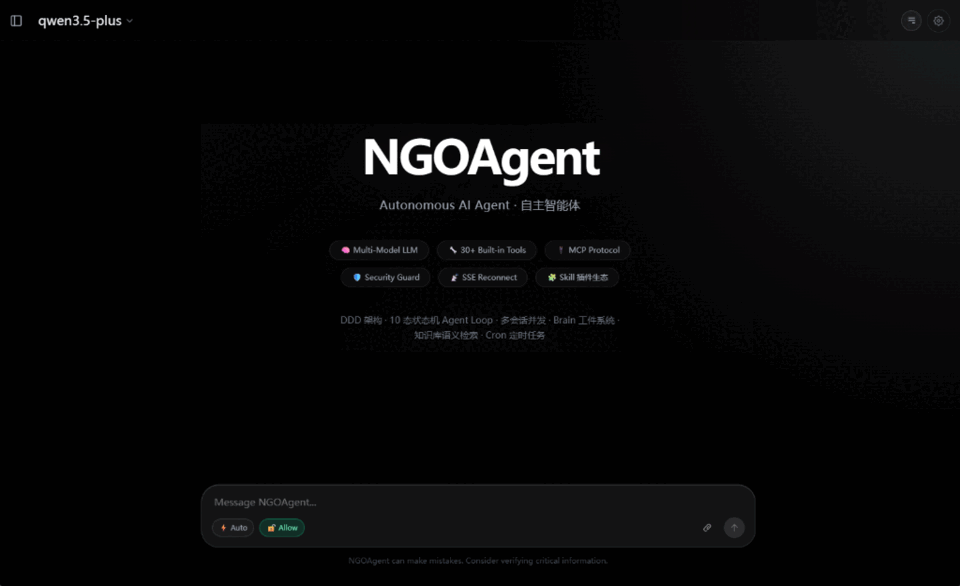
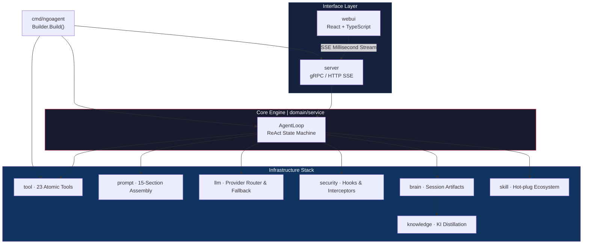

<p align="center">
  
  
  
  
</p>

<p align="center">
  <strong>English</strong> | <a href="README_ZH.md">简体中文</a>
</p>

# NGOAgent: Edge Autonomous AI OS

**Built for real-world complexity: An enterprise-grade, local-first autonomous agent architecture.**

> *"Beyond chatbots. Beyond scripts. We are defining true autonomous action at the edge."*

In an era where data privacy is paramount, NGOAgent emerges as a production-ready, autonomous AI operating system. Driven by over **30,000 lines of robust Go code**, it leverages native Domain-Driven Design (DDD), a 10-state ReAct engine, and bank-grade security to deliver **cognitive automation** directly into your private environment.

<p align="center">
  
</p>

---

## 💥 The 7 Core Moats

NGOAgent shatters the fragility of "toy project" Python scripts by prioritizing production-ready deployment, absolute security, and infinite extensibility from day one:

### 1. 🛡️ Local-First Data Sovereignty

Seamlessly integrates with local massive models (Ollama, vLLM) or privatized cloud APIs. Not a single byte leaves your trusted perimeter—directly solving the "data exfiltration" crisis in finance and medical R&D.

### 2. 🧠 Agentic LoopPool™ & State Machine Engine

A highly deterministic **10-state ReAct decision engine** equips the Agent with human-like "think, plan, execute, verify, retry" capabilities. The proprietary **LoopPool** technology ensures hard-isolated concurrency, completely eliminating state pollution.

### 3. 🐝 True Architecture-Level SubAgent Swarm Design

Most "multi-agent" frameworks are mere Prompt-illusions sharing a single context. Built on Go's powerful concurrency, NGOAgent's primary Agent can instantly hatch dozens of real algorithmic sub-agents running in independent routines with private memory zones. This creates a true dual-track system: lightweight models plan at lightning speed, while heavy-duty models execute concurrently. A genuine, context-isolated distributed AI cluster.

### 4. 🔌 Native Skill Ecosystem & Forge Sandbox

Ditching bulky 3rd-party protocols, NGOAgent ships with a lightweight, hot-loadable Native Skill ecosystem. Encapsulate any proprietary system into a custom "Skill" with minimal code. Crucially, unverified code is rigorously tested in the proprietary **Forge Sandbox** for zero-risk deployment.

### 5. 🔗 Unbreakable SSE Telemetry

Designed for the real world. A heavily buffered Server-Sent Events (SSE) network layer ensures the Agent keeps fighting through network drops, page refreshes, or closed laptops. Upon reconnection, progress and full log streams are instantly restored.

### 6. 💂‍♂️ Bank-Grade Security Hooks

Implements a granular `Allow / Auto / Ask` permission triad. High-risk operations (e.g., mass deletions, system commands) auto-trip the circuit breaker, sending interactive approval requests cross-platform. Humans retain the ultimate kill switch.

### 7. 🏗️ Agile DDD Customization

Fiercely model-agnostic. Grounded in a Go-based **Domain-Driven Design (DDD)** core, this highly decoupled architecture allows enterprise clients in highly regulated verticals to rapidly inject custom business logic and swap out reasoning engines with Lego-like agility—without risking system stability.

---

## 🚀 Roadmap & Development Progress

**Current focus and upcoming milestones:**

- **[In Progress] WebUI Refinement & Optimization:** 
  Enhancing the React-based frontend for a premium user experience, smoother Markdown streaming rendering, and visually tracking complex tool-call chains.

- **[Preparing] Chat Bot Integrations:** 
  Building robust Telegram/Discord bot adapters via the gRPC layer, bringing NGOAgent's autonomous cognitive capabilities directly to your mobile messaging platforms.

---

## 🧩 Architecture Blueprint

An entirely self-contained streaming architecture covering engine, persistence, memory, and extension systems:



---

## ⚡ Quick Start

### Prerequisites

- **Go** ≥ 1.24
- **Node.js** ≥ 18 (For the visually stunning React Web UI)
- **ripgrep** (`rg`) & **fd** — Backend dependencies for lightning-fast search

### Local Build & Deploy

```bash
# 1. Clone repository
git clone https://github.com/ngoclaw/ngoagent.git
cd ngoagent

# 2. Build Go backend
go build -o ngoagent ./cmd/ngoagent

# 3. Start daemon (Auto-bootstraps ~/.ngoagent and outputs Auth Token)
./ngoagent serve
# ╔══════════════════════════════════════════════════════════════╗
# ║  AUTH TOKEN GENERATED (save this for frontend connection):   ║
# ║  e.g: a1b2c3d4...64-char-hex...                             ║
# ╚══════════════════════════════════════════════════════════════╝

# 4. Start Web UI
cd webui && npm install && npm run dev
# Open http://localhost:5173, enter the generated token for secure handshake
```

---

## ⚙️ Configuration

Auto-generates a fully-commented `~/.ngoagent/config.yaml` on first run (supports **Hot Reload**):

```yaml
agent:
  workspace: "~/.ngoagent/workspace"  # Workspace boundary
  planning_mode: false                # Heuristic planning triggering

llm:
  providers:
    - name: "local_ollama"
      type: "openai"
      base_url: "http://localhost:11434/v1"
      models: ["huihui-opus:latest", "qwen2.5-coder"]

security:
  mode: "auto"                        # allow / auto / ask permission triad
  block_list: ["rm", "rmdir", "mkfs", "dd", "shutdown"]
  safe_commands: ["ls", "cat", "grep", "find", "go", "npm", "git"]

server:
  http_port: 19997
  auth_token: "<auto-generated>"      # High-entropy SHA-256 validation code
```

---

## 🧰 Toolchain Overview

Equipped with **23+ atomic tools** bridging the AI directly to your operating system.

| Category | Tools | Core Use Case |
|----------|------------|----------|
| **File System** | `read_file`, `write_file`, `edit_file`, `undo_edit` | Parallel code editing, regex replacement, crash-preventing rollbacks |
| **Async CLI** | `run_command`, `command_status` | Non-blocking terminal execution, prevents hanging long processes |
| **Search & Glob** | `grep_search`, `glob` | Lightning-fast rust-based source code scanning and directory sniffing |
| **Web Intelligence**| `web_search`, `web_fetch` | Integrated SearXNG proxying and HTML purification for breaking data silos |
| **Memory & Ctx**  | `save_memory`, `update_project_context` | Persistent Knowledge Item (KI) aggregation and project-specific context pinning |
| **Swarm Routing**| `task_boundary`, `task_plan`, `spawn_agent` | PEV cycle slicing, spawning SubAgents for parallel complex module refactoring |

---

## 🛡️ SSE + Auth Security

1. **Token Authentication Chain**: Auto-generates high-entropy pseudo-random SHA256 hashed keys on first boot for mandatory Bearer authentication.
2. **Breakpoint Recovery Protocol**: The `/v1/chat/reconnect` API ensures robust reconnection after browser crashes, continuously replaying the streaming history.

---

## 📖 Documentation & Resources

- [**design.md**](docs/design.md) — 2000 lines of pure Go DDD architectural teardown
- [**architecture.md**](docs/architecture.md) — Overview, dependency structures, and God-Interface elimination

> *"This is the ultimate workspace for your digital colleagues—a truly open-source AI nerve center capable of heavy-duty refactoring and physical system interaction."*

---

## License

[Business Source License 1.1](LICENSE)
