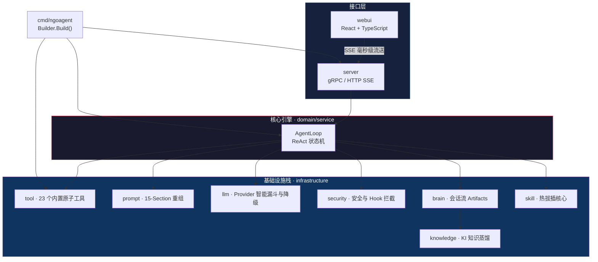

<p align="center">
  
  
  
  
</p>

# NGOAgent: 边缘计算自治 AI 操作系统

**为真实世界的复杂工作流而生：企业级、本地优先的自主智能体架构。**

> “不再是聊天机器人，不再是一次性脚本。我们正在定义边缘侧的真正自主行动标杆。”

在数据隐私成为核心壁垒、企业自动化日益复杂的今天，NGOAgent 作为一款生产级、自主决策的 AI 操作系统应运而生。它由超过 **30,000 行健壮的 Go 生产代码** 驱动，依靠原生的领域驱动设计 (DDD)、10状态 ReAct 引擎和金融级安全护栏，将**认知自动化**直接交付到用户的隐私环境中。

<p align="center">
  
</p>

---

## 💥 六大核心护城河 (The Moat)

NGOAgent 从第一天起就以**生产级部署、绝对安全和无限扩展**为核心目标，打破了开源 Agent “玩具级”脚本的脆弱魔咒：

1. 🛡️ **绝对的数据主权 (Local-First)**
   完美接入本地部署的百亿/千亿大模型（Ollama、vLLM）或私有化云端接口。没有任何数据会离开受信任区域，直击金融、医疗研发中“数据出境”的核心痛点。
2. 🧠 **Agentic LoopPool™ & ReAct 引擎**
   高度确定性的 **10 状态 ReAct 状态机**，赋予 Agent 人类般的“思考、规划、执行、验证、重试”决策闭环。独创的 **LoopPool** 池化技术实现了千人千面的硬隔离并发，彻底告别状态污染。
3. 🔌 **繁荣的私有体系：原生 Skill 插件生态与 Forge 沙箱**
   摒弃笨重的第三方协议，NGOAgent 拥有一套极度轻量的原生 Skill 热加载生态。只需几行代码，即可将企业私有 ERP、飞书审批流、K8s 调度封装为专属“数字触角”。所有未经审计的代码均会在独创的 **Forge（锻造沙箱）** 中严格隔离演练，确保零风险上线。
4. 🔗 **永不失联的高可用层 (SSE Telemetry)**
   专为残酷生产环境设计。重度缓冲的 SSE (Server-Sent Events) 网络层，在网络抖动、页面刷新、甚至笔记本合上期间，后台 Agent 仍死磕任务；网络一经恢复，执行进度条与全量日志瞬间残血回退、同步归位。
5. 💂‍♂️ **跨入深水区的“金融级”安全靶向**
   实现了细粒度的 `Allow / Auto / Ask` 权限三叉戟。敏感操作（如大批量删改、高危命令）会自动熔断，并向 Web UI 或 Telegram 发送交互式审批请求。人类永远握着绝对的“一键终止”倒挂开关。
6. 🏗️ **领域驱动设计 (DDD) 赋能的极速业务定制**
   极度的“Model-Agnostic”（模型脱钩）。凭借 Go 语言 **领域驱动设计 (DDD)** 的高内聚、松耦合内核，面对任何特定垂直行业（军工、量化计算）的私有化定制需求，都能以乐高式的敏捷速度进行二次开发与重构，永不崩塌。

---

## 🧩 核心架构图 (Architecture)

NGOAgent 不受算力平台绑架，在内网独立运转了一整套涵盖引擎、持久化、记忆与扩展体系的流式架构：



---

## ⚡ 极速开始 (Quick Start)

### 前置环境

- **Go** ≥ 1.24
- **Node.js** ≥ 18 (运行极地质感的 React Web UI)
- **ripgrep** (`rg`) & **fd** — 底层闪电搜索工具依赖

### 本地构建部署

```bash
# 1. 深度克隆基座
git clone https://github.com/ngoclaw/ngoagent.git
cd ngoagent

# 2. 核心后端构建
go build -o ngoagent ./cmd/ngoagent

# 3. 守护进程启动 (零配置自举 ~/.ngoagent，并生成金钥 Token)
./ngoagent serve
# ╔══════════════════════════════════════════════════════════════╗
# ║  AUTH TOKEN GENERATED (save this for frontend connection):   ║
# ║  e.g: a1b2c3d4...64个字符...                                ║
# ╚══════════════════════════════════════════════════════════════╝

# 4. 前端空间启动
cd webui && npm install && npm run dev
# 浏览器访问 http://localhost:5173，输入生成的 Token 完成安全握手
```

---

## ⚙️ 动态配置注入 (Configuration)

摒弃复杂的部署链条。首次启动即可自生成带全量注释的中心配置文件 `~/.ngoagent/config.yaml`（支持**热更新重载**）：

```yaml
agent:
  workspace: "~/.ngoagent/workspace"  # 物理隔离边界
  planning_mode: false                # NLP启发式触发 Plan

llm:
  providers:
    - name: "local_ollama"
      type: "openai"
      base_url: "http://localhost:11434/v1"
      models: ["huihui-opus:latest", "qwen2.5-coder"]

security:
  mode: "auto"                        # allow / auto / ask 三级鉴权
  block_list: ["rm", "rmdir", "mkfs", "dd", "shutdown"]
  safe_commands: ["ls", "cat", "grep", "find", "go", "npm", "git"]

server:
  http_port: 19997
  auth_token: "<auto-generated>"      # 高阶熵 SHA-256 安全验证令
```

---

## 🧰 超级挂载套件 (Toolchain)

NGOAgent 目前配备 **23 项原子工具**，完全打通与主流开发栈和互联网的结界边界。

| 功能象限 | 原生工具标示 | 底层用途 |
|----------|------------|----------|
| **磁盘 I/O** | `read_file`, `write_file`, `edit_file`, `undo_edit` | 大规模代码重构、多行安全正则替换、精确读写防崩溃 |
| **Shell 脱管** | `run_command`, `command_status` | 非阻塞异步终端执行，防死结轮询机制 |
| **全息搜索** | `grep_search`, `glob` | 基于 Rust 底层的极速内容搜集与文件嗅探 |
| **广域信息** | `web_search`, `web_fetch` | 无缝整合私有化 SearXNG 集群，破除信息孤岛 |
| **意识持久** | `save_memory`, `update_project_context` | 沉淀全局 KI (Knowledge Item) 资产与项目特定环境上下文 |
| **多体协同** | `task_boundary`, `task_plan`, `spawn_agent` | PEV 进度跟踪，全周期长文执行规划，甚至子 Agent 横向繁殖 |

---

## 🛡️ 零摩擦双轨流式安全握手 (SSE + Auth)

所有通信被重度保护并封装在 `DeltaSink` 和基于 Token 的防窃听漏斗下：

1. **Token 鉴权链**：首次起服自动通过伪随机熵与 SHA256 签发 64 字节 Hex 码，前端依靠 `Authorization: Bearer <Token>` 头交互。
2. **断点回溯协议 (Reconnect)**：连接中断期间一切推理继续进行；重连瞬发 `/v1/chat/reconnect` 请求触发内存快照历史流（Text, Reasoning, Tool_Call）回放式下发。

---

## 📖 设计手札与开发者资源

深入了解极其硬核的代码构造，推荐细读核心架构文档：
- [**design.md**](docs/design.md) — 2000 行纯粹的后端 DDD 拆解思路
- [**architecture.md**](docs/architecture.md) — 概览、依赖结构、God Interface 抹除技巧

> “这是数字同时的超级办公桌，一个真正能跑通千行代码长链重构、具有物理反制能力的开源 AI 中枢。”

---

## License

[Business Source License 1.1](LICENSE)
