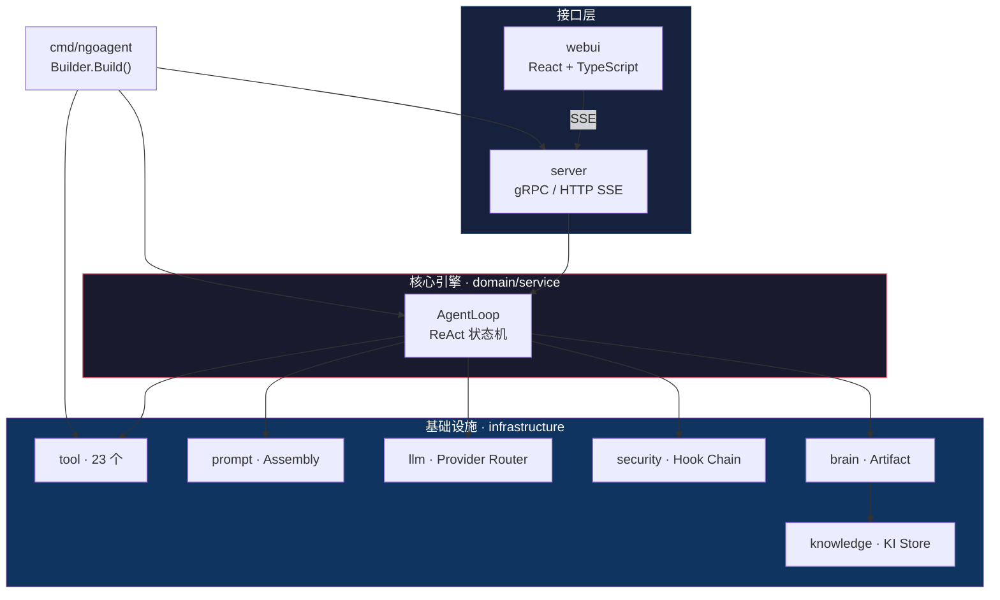
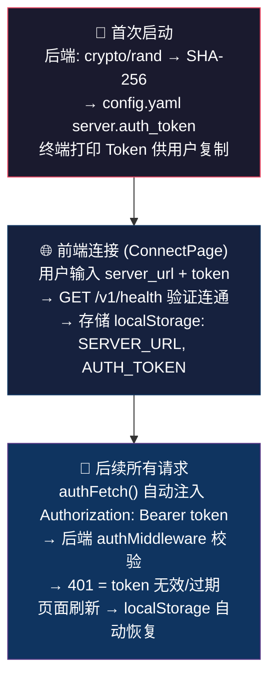

<p align="center">
  
  
  
  
</p>

# NGOAgent

**自主式本地 AI Agent** — 运行在你自己机器上的通用自主智能体，具备文件操作、Shell 执行、Web 搜索、知识管理、定时任务、子 Agent 委派等完整能力。不局限于编码，可执行任何需要工具调用的复杂任务。

> ~30K LOC · 21+ 内置工具 · React Web UI · HTTP SSE（断线重连） · LoopPool 多会话并发

---

## 核心特性

| 特性 | 描述 |
|------|------|
| 🧠 **ReAct 循环** | 10 状态机驱动的自主决策循环，支持工具调用、上下文压缩、自动重试 |
| 🔧 **21+ 内置工具** | 文件读写编辑、Shell 执行、Grep/Glob 搜索、Web 搜索/抓取、知识管理、Brain Artifact |
| 📝 **Prompt Assembly** | U 形注意力布局的系统提示词组装，4 级预算裁剪，支持可插拔组件 |
| 🛡️ **安全决策链** | Allow / Auto / Ask 三级权限，命令黑名单，工具级审批，审计日志 |
| 🧩 **技能 + 锻造** | Skill 热加载 + Forge 沙箱验证，MCP 协议集成 |
| 💾 **跨会话知识** | Brain Artifact (会话级) + KI Store (全局级)，LLM 自动蒸馏 |
| ⏰ **定时任务** | Cron 引擎，独立会话隔离，支持自主巡检 |
| 📡 **SSE 断线重连** | BufferedDelta 事件缓冲 + RunTracker 活跃任务跟踪，页面刷新/网络抖动自动恢复 |
| 🔀 **LoopPool 并发** | 多会话隔离并发，每个会话独立 AgentLoop + Brain + History |

---

## 架构



---

## 快速开始

### 前置依赖

- **Go** ≥ 1.24
- **Node.js** ≥ 18 (Web UI)
- **ripgrep** (`rg`) — grep_search 工具依赖
- **fd** — glob 工具 (可选, 自动降级到 `find`)

### 构建 & 启动

```bash
# 1. 克隆
git clone https://github.com/ngoclaw/ngoagent.git
cd ngoagent

# 2. 构建后端
go build -o ngoagent ./cmd/ngoagent

# 3. 首次启动 (自动初始化 ~/.ngoagent/ 并生成鉴权 Token)
./ngoagent serve
# ╔══════════════════════════════════════════════════════════════╗
# ║  AUTH TOKEN GENERATED (save this for frontend connection):   ║
# ║  a1b2c3d4...64 字符 hex...                                  ║
# ╚══════════════════════════════════════════════════════════════╝

# 4. 构建并启动 Web UI
cd webui && npm install && npm run dev
# 访问 http://localhost:5173 → 输入 Token 连接
```

### 配置

首次启动自动生成 `~/.ngoagent/config.yaml`，参考 [config.example.yaml](config.example.yaml)：

```yaml
agent:
  planning_mode: false
  workspace: "~/.ngoagent/workspace"

llm:
  providers:
    - name: "default"
      type: "openai"
      base_url: "https://api.openai.com/v1"
      api_key: "${OPENAI_API_KEY}"
      models: ["gpt-4"]

security:
  mode: "auto"            # allow / auto / ask
  block_list: ["rm", "rmdir", "mkfs", "dd", "shutdown"]

server:
  http_port: 19997
  auth_token: "<auto-generated>"  # SHA-256 鉴权 Token (首次启动自动生成)
```

> **提示**：API Key 通过环境变量注入，不会写入配置文件。支持所有 OpenAI 兼容 API。

---

## Token 鉴权

所有 API 请求**强制鉴权**（`/v1/health` 除外）。

| 项目 | 说明 |
|------|------|
| **生成时机** | 首次启动时自动生成 (`crypto/rand` 32B → SHA-256 → 64 字符 hex) |
| **存储** | `~/.ngoagent/config.yaml` 的 `server.auth_token` |
| **传输方式** | HTTP Header `Authorization: Bearer <token>` |
| **前端连接** | 打开 Web UI → 输入服务器地址 + Token → 验证通过后自动存储到 localStorage |

### 前后端 Token 链路



```bash
# 查看已生成的 Token
grep auth_token ~/.ngoagent/config.yaml

# 手动重新生成
python3 -c "import hashlib,secrets; print(hashlib.sha256(secrets.token_bytes(32)).hexdigest())"
# 将输出粘贴到 config.yaml 的 auth_token 字段，重启后端生效
```

---

## 自动初始化

首次启动时，NGOAgent 自动创建 `~/.ngoagent/` 目录：

```
~/.ngoagent/
├── config.yaml       配置文件 (含 auth_token)
├── mcp.json          MCP 服务器配置 (Claude Code 兼容格式)
├── user_rules.md     用户规则 (Agent 行为)
├── .state.json       启动状态 (new → ready)
├── data/             SQLite 数据库
├── brain/            会话级 Artifact
├── knowledge/        全局知识 (KI Store)
├── skills/           技能目录 (热加载)
├── cron/             定时任务
├── workspace/        默认工作目录
├── forge/            锻造沙箱
├── prompts/          提示词变体
├── mcp/              MCP 运行时数据
└── logs/             运行日志
```

---

## 工具清单

| 类别 | 工具 | 描述 |
|------|------|------|
| **文件** | `read_file` | 读取文件，自动行号标注，二进制检测 |
| | `write_file` | 创建/覆盖文件，自动建目录 |
| | `edit_file` | 精确字符串替换，模糊匹配降级 |
| | `undo_edit` | 撤销文件编辑 |
| **Shell** | `run_command` | Bash 执行，后台模式，超时控制 |
| | `command_status` | 查询后台命令状态 |
| **搜索** | `grep_search` | 基于 ripgrep 的代码搜索 |
| | `glob` | 基于 fd 的文件查找 (自动降级 find) |
| **Web** | `web_search` | SearXNG 搜索引擎查询 |
| | `web_fetch` | URL 内容抓取 |
| **知识** | `save_memory` | 写入全局 KI Store |
| | `update_project_context` | 写入项目级 context.md |
| **协作** | `task_boundary` | Planning/Execution/Verification 模式切换 |
| | `task_plan` | Brain Artifact (plan/task/walkthrough) |
| | `notify_user` | 审批请求 + 用户通知 |
| | `spawn_agent` | 子代理委派 |
| | `send_message` | 跨会话消息发送 |
| **扩展** | `script_tool` | 自定义脚本工具 (Skill 自动注册) |
| | `mcp_adapter` | MCP 协议桥接 |
| | `forge` | 能力锻造 (沙箱验证) |
| | `manage_cron` | 定时任务 CRUD |

---

## 项目结构

```
NGOAgent/
├── cmd/ngoagent/           程序入口
├── internal/
│   ├── domain/service/     核心引擎 (AgentLoop · DeltaSink · Guard)
│   ├── infrastructure/
│   │   ├── tool/           23 个内置工具
│   │   ├── llm/            LLM Provider Router
│   │   ├── prompt/         Prompt Assembly Pipeline
│   │   ├── security/       安全决策链
│   │   ├── brain/          会话 Artifact
│   │   ├── knowledge/      跨会话知识 (KI)
│   │   ├── skill/          技能系统
│   │   ├── cron/           定时任务引擎
│   │   ├── mcp/            MCP 协议
│   │   ├── config/         配置管理 + 热重载
│   │   ├── persistence/    SQLite 持久化
│   │   └── sandbox/        命令沙箱
│   ├── application/        API 层 (Builder · AgentAPI)
│   └── interfaces/
│       ├── server/         HTTP SSE 服务器
│       └── grpc/           gRPC 服务器
├── webui/                  React + TypeScript 前端
├── api/proto/              gRPC Protobuf 定义
├── docs/                   设计文档
└── config.example.yaml     配置示例
```

---

## 流式协议

所有输出通过统一的 `DeltaSink` 接口流式传输，支持断线重连：

```
LLM → AgentLoop → BufferedDelta → SSE Writer → Client
                       ↕
              断连时缓冲到内存
              重连时回放 + 续流
```

| 事件 | 字段 | 描述 |
|------|------|------|
| `text_delta` | `content` | 文本流 |
| `thinking` | `content` | 推理过程 |
| `tool_start` | `name`, `args` | 工具开始 |
| `tool_result` | `call_id`, `output`, `error` | 工具结果 |
| `progress` | `task_name`, `status`, `mode` | 任务进度 |
| `approval_request` | `approval_id`, `tool_name`, `reason` | 审批请求 |
| `plan_review` | `message`, `paths` | 方案审查 |
| `error` | `message` | 错误 |
| `step_done` | — | 步骤完成 |

### SSE 端点

| 端点 | 方法 | 描述 |
|------|------|------|
| `/v1/chat` | POST | 发送消息，SSE 流式响应 |
| `/v1/chat/status?session_id=xxx` | GET | 查询是否有活跃 run |
| `/v1/chat/reconnect?session_id=xxx&last_seq=0` | GET | 断线重连，自动回放缓冲事件 |

---

## gRPC API (可选)

NGOAgent 支持 gRPC API，默认关闭（`grpc_port: 0`）。启用方法：

```yaml
# ~/.ngoagent/config.yaml
server:
  grpc_port: 19998   # 设为非零端口即可启用
```

完整 RPC 定义见 [agent_service.proto](api/proto/agent_service.proto)。

---

## 开发

```bash
# 后端编译
go build -o ngoagent ./cmd/ngoagent

# 后端测试
go test ./internal/...

# 前端开发 (热重载)
cd webui && npm run dev

# 前端生产构建
cd webui && npm run build
```

---

## 设计文档

- [**design.md**](docs/design.md) — 完整后端设计
- [**architecture.md**](docs/architecture.md) — 架构蓝图

---

## License

MIT
