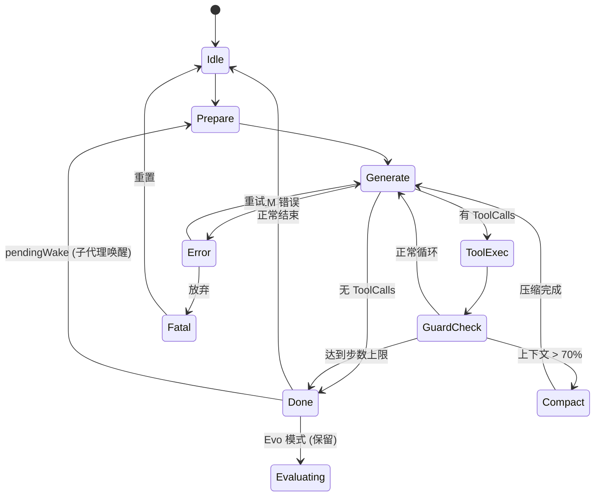
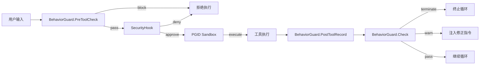

# NGOAgent 架构设计文档

> **版本**: v0.6.0 | **代码规模**: 160+ Go 文件 / 35,000+ 行 | **审计日期**: Phase 7-A/B/C 加固完成

---

## 1. 系统总览

### 1.1 项目结构

```text
NGOAgent/
├── cmd/ngoagent/                # 程序入口 main.go
├── internal/
│   ├── application/             # 应用层 (3 files, ~1770 lines)
│   │   ├── api.go               # AgentAPI — 协议无关的统一门面 (973L)
│   │   ├── builder.go           # 8 阶段依赖注入组装器 (783L)
│   │   └── adapters.go          # 跨层适配器桥接 (166L)
│   ├── domain/                  # 领域层 — 零外部技术依赖
│   │   ├── entity/entity.go     # 核心实体: Conversation, Message, Skill, EvoRun
│   │   ├── errors/errors.go     # 🚨 统一错误域系统 (6 类 Domain Errors)
│   │   ├── model/               # 跨层抽象领域模型
│   │   ├── profile/             # 行为叠加层: Omni + Coding + Research 覆盖
│   │   ├── prompttext/          # 提示词片段库 (8 files): core, behavior, ephemeral, subagent, evo, conditional
│   │   ├── service/             # 核心引擎 (38 files, ~6800 lines) — 本文档重点
│   │   │   └── ports.go         # 🎯 端口防腐层契约
│   │   └── tool/                # 工具协议: Signal/Dispatch/ToolResult/ToolMeta
│   ├── infrastructure/          # 基础设施层 (18 subdirs)
│   │   ├── brain/               # Artifact 存储 (plan.md, task.md)
│   │   ├── config/              # YAML 配置热重载
│   │   ├── cron/                # 定时任务管理器
│   │   ├── evolution/           # Skill 自进化持久层
│   │   ├── heartbeat/           # 心跳探测
│   │   ├── knowledge/           # KI 三层检索 (L0/L1/L2)
│   │   ├── logger/              # 🚨 基于 log/slog 的结构化日志核心
│   │   ├── llm/                 # LLM 适配器 + Router + 多级错误分类
│   │   ├── mcp/                 # Model Context Protocol 管理器
│   │   ├── memory/              # 向量语义记忆 + 日记本
│   │   ├── notify/              # Webhook 事件通知
│   │   ├── persistence/         # GORM 持久化 (SQLite/PostgreSQL)
│   │   ├── prompt/              # 18-Section 提示词组装引擎
│   │   ├── sandbox/             # PGID 进程组沙箱
│   │   ├── security/            # AI 安全分类器 + Shell 注入检测
│   │   ├── skill/               # 技能管理器 + 工作流引擎
│   │   ├── tool/                # 37 个工具实现
│   │   └── workspace/           # 工作区生态 (@include, 附件, 文件历史)
│   ├── interfaces/              # 传输层
│   │   ├── apitype/             # API 请求/响应类型定义
│   │   ├── bot/                 # Telegram Bot 适配器
│   │   ├── grpc/                # gRPC 服务端 (714L)
│   │   └── server/              # HTTP/WS 服务端 (877L server + 362L ws_handler)
│   └── testing/                 # 测试基础设施
├── webui/                       # React 前端 (Vite + MUI)
│   └── src/
│       ├── App.tsx              # 主应用入口 + ScrollProvider 架构
│       ├── stores/              # Zustand 状态管理 (messageStore, uiStore)
│       ├── renderers/           # 消息渲染器 (ChatViewer, ChatVirtualList, InputForm)
│       ├── components/          # UI 组件 (Sidebar, Settings, BrainPanel, KIManager...)
│       ├── providers/           # React Context (Stream, Scroll, Theme)
│       └── hooks/               # 自定义 Hooks
├── agent-search/                # Python 搜索服务 (SearXNG + 反反爬)
├── pkg/                         # 公共工具包
└── scripts/                     # 运维脚本
```

### 1.2 架构分层

采用 **整洁架构 (Clean Architecture)**，依赖关系严格由外向内。

```mermaid
graph TD
    subgraph Interfaces ["传输层 (Interfaces)"]
        HTTP["HTTP API + SSE"]
        WS["WebSocket"]
        GRPC["gRPC Server"]
        TG["Telegram Bot"]
    end

    subgraph Application ["应用层 (Application)"]
        API["AgentAPI — 统一门面"]
        Builder["Builder — 8阶段组装"]
        Adapters["Adapters — 跨层桥接"]
    end

    subgraph Domain ["领域层 (Domain)"]
        Loop["AgentLoop — 10状态 FSM"]
        Guard["BehaviorGuard — 行为护栏"]
        Compact["Compact — 三级压缩"]
        Barrier["SubagentBarrier — 子代理屏障"]
        Hooks["HookManager — AOP 生命周期"]
        Proto["Tool Protocol — Signal/Dispatch"]
        Prompt["PromptText — 提示词片段"]
        Profile["Profile — 行为叠加"]
        Errors["Domain Errors — 全局错误体系"]
    end

    subgraph Infra ["基础设施层 (Infrastructure)"]
        LLM["LLM Router + 16 Provider"]
        Logger["Global SLOG Logger"]
        PE["PromptEngine — 18 Section"]
        Tools["37 Tools + Registry"]
        Brain["ArtifactStore"]
        KI["KnowledgeStore — 三层检索"]
        Sandbox["Sandbox — PGID 隔离"]
        Security["SecurityHook — AI 分类"]
        MCP["MCP Manager"]
        Persist["GORM Persistence"]
        Memory["Vector Memory"]
    end

    HTTP --> API
    WS --> API
    GRPC --> API
    TG --> API
    API --> Loop
    Builder --> API
    Loop --> Guard
    Loop --> Compact
    Loop --> Barrier
    Loop --> Hooks
    Loop --> Proto
    LLM -.-> Loop
    PE -.-> Loop
    Tools -.-> Loop
    Brain -.-> Loop
    KI -.-> Loop
    Sandbox -.-> Tools
    Security -.-> Loop
    MCP -.-> Tools
    Persist -.-> Loop
    Memory -.-> Loop
```



### 1.3 核心数据流

```mermaid
sequenceDiagram
    participant U as 用户/WebUI
    participant WS as WebSocket Handler
    participant API as AgentAPI
    participant CE as ChatEngine
    participant Pool as LoopPool
    participant Loop as AgentLoop
    participant PE as PromptEngine
    participant LLM as LLM Router
    participant Guard as BehaviorGuard
    participant Tools as ToolRegistry
    participant DB as Persistence

    U->>WS: WS message {session_id, content, content_parts}
    WS->>API: ChatStream(sessionID, message, mode, delta)
    API->>CE: Chat(ctx, sessionID, message)
    CE->>Pool: Get(sessionID) → AgentLoop
    CE->>DB: LoadAll(sessionID) [if empty history]
    CE->>Loop: Run(ctx, userMessage)
    Loop->>Loop: TryAcquire(runMu) [排他锁]

    loop ReAct Loop
        Loop->>PE: AssembleSplit(deps) → static + dynamic
        Loop->>LLM: GenerateStream(req, ch) [带 cache_control]
        LLM-->>WS: StreamChunk → OnText/OnReasoning [实时推送]
        LLM-->>Loop: Response{Content, ToolCalls, Reasoning}
        Loop->>Guard: Check(response, toolCalls, step)

        alt ToolCalls 存在
            Loop->>Tools: splitToolCalls → ReadOnly ∥ Write
            Tools-->>Loop: ToolResult{Output, Signal, Payload}
            Loop->>Proto: Dispatch(result, sink, state)
        else 无 ToolCalls
            Loop->>Loop: transition(StateDone)
        end
    end

    Loop->>DB: persistHistory() [增量追加]
    Loop->>WS: OnComplete()
    Loop-->>Loop: fireHooks(async) → Title/KI/Memory/Evo
```

---

## 2. Domain Layer — 领域层

### 2.1 Entity 实体定义

**文件**: `internal/domain/entity/entity.go` (57L)

| 实体 | 关键字段 | 说明 |
|---|---|---|
| **Conversation** | ID, Channel, Title, Status, CreatedAt, UpdatedAt | 会话元数据容器 |
| **Message** | ID, ConversationID, Role, Content, ToolCallID | 核心消息载体 |
| **Skill** | Name, Weight(`light`/`heavy`), Triggers[], Rules[], EvoStatus, Category, KIRef[] | 技能能力封装 |
| **EvoRun** | SkillID, Success, Strategy(`param_fix`/`tool_swap`/`re_route`/`iterate`/`escalate`), FailureReason | 自进化执行轨迹 |

### 2.2 Port 接口契约 (依赖反转网关)

**文件**: `internal/domain/service/ports.go` 

> ✅ **Phase 7 架构优化解决**: 清除了原存在于 Domain 的物理基础包 import 反向依赖。当前遵循 Go "Consumer-side interface" 防腐层原则，引擎侧定义完全轻量的防腐接口协议。

**物理依赖阻断**:

| 接口 | 位置 | 防腐隔离目标 (Infrastructure) |
|---|---|---|
| `ArtifactReader` | ports.go:24 | `brain.ArtifactStore` |
| `KIIndexer`      | ports.go:36 | `knowledge.Store` |
| `WorkspaceReader`| ports.go:46 | `workspace.Store` |
| `SkillLister`    | ports.go:58 | `skill.Manager` |
| `SecurityChecker`| ports.go:96 | `security.Hook` |
| `ModelRouter`    | ports.go:109| `llm.Router` & `llm.Provider` |
| `DeltaSink`      | loop.go:33  | 事件总线及 Server 层 Websocket Hook |

### 2.3 Service 核心服务

#### 2.3.1 AgentLoop 主结构 (`loop.go`, 454L)

`AgentLoop` 是引擎的运行实例，拥有完整的生命周期管理：

```go
type AgentLoop struct {
    deps Deps              // 全部依赖注入 (见 Deps 结构体)

    // ── 生命周期同步 ──
    state     State         // 10 状态 FSM
    mu        sync.Mutex    // 保护: history, ephemerals, task, evo state
    runMu     sync.Mutex    // 排他锁: 一 Session 一任务
    stopCh    chan struct{}  // Stop() 信号
    runCancel context.CancelFunc  // 取消运行上下文

    // ── 历史与持久化 ──
    history        []llm.Message  // 内存对话历史
    persistedCount int            // 已持久化消息数 (增量写基线)
    ephemerals     []string       // 下一轮 LLM 调用的临时注入
    pendingWake    atomic.Bool    // 子代理完成标志

    // ── 上下文追踪 ──
    task             *TaskTracker     // 步骤/工件/边界追踪
    pendingMedia     []map[string]string  // 多模态媒体待注入
    tokenTracker     TokenTracker     // 混合 API+估算 token 追踪
    cacheTracker     llm.CacheTracker // 系统提示词缓存命中追踪
    compactCount     int             // 连续压缩次数 (防摘要丢失)
    outputContinuations int          // 输出截断自动续写次数

    // ── 阶段检测与梦境 ──
    phaseDetector *PhaseDetector   // 4 阶段执行检测
    dream         *DreamTask       // 空闲时后台知识萃取

    // ── Evo 状态 ──
    evoLastEval      *EvalResult
    evoLastPlan      *RepairPlan
    traceCollector   *TraceCollectorHook

    // ── 运行时配置 ──
    mode ModePermissions  // auto | plan | agentic (+evo)
}
```

**Deps 依赖包** (loop.go:67):

| 分类 | 字段 | 类型 | 说明 |
|---|---|---|---|
| Core | Config | `*config.Config` | 全局配置 |
| Core | ConfigMgr | `*config.Manager` | 热重载管理 |
| Core | LLMRouter | `*llm.Router` | 多提供商路由 |
| Core | PromptEngine | `*prompt.Engine` | 18-Section 组装 |
| Core | ToolExec | `ToolExecutor` | 工具执行器 |
| Core | Security | `*security.Hook` | 安全审计 |
| Core | Delta | `DeltaSink` | 流式事件总线 |
| Storage | Brain | `*brain.ArtifactStore` | 工件存储 |
| Storage | KIStore | `*knowledge.Store` | 知识库 |
| Storage | KIRetriever | `KISemanticRetriever` | 语义检索 (可选) |
| Storage | Workspace | `*workspace.Store` | 工作区生态 |
| Storage | SkillMgr | `*skill.Manager` | 技能管理 |
| Persist | HistoryStore | `HistoryPersister` | 消息持久化 |
| Persist | FileHistory | `*workspace.FileHistory` | 文件编辑快照回滚 |
| Persist | Hooks | `*HookManager` | AOP 生命周期钩子 |
| Persist | MemoryStore | `MemoryStorer` | 向量记忆 (可选) |
| Evo | EvoEvaluator | `*EvoEvaluator` | 质量评估 (可选) |
| Evo | EvoRepairRouter | `*RepairRouter` | 修复策略 (可选) |
| Evo | EvoStore | `*persistence.EvoStore` | Evo 持久化 (可选) |
| Async | EventPusher | `func(sessionID, eventType, data)` | WS 异步推送 |
| Async | TranscriptStore | `*persistence.TranscriptStore` | Worker 转录 (可选) |
| Async | WebhookHook | `WebhookNotifyHook` | Webhook 通知 (可选) |

#### 2.3.2 状态机 (`state.go`, 83L)

10 个物理状态 + 合法迁移表:



#### 2.3.3 执行模式 (`mode_permissions.go`, 63L)

双轴正交设计:

| 执行模式 | ForcePlan | AutoApprove | SelfReview | PhaseDetect |
|---|---|---|---|---|
| `auto` | ❌ | ❌ | ❌ | ❌ |
| `plan` | ✅ | ❌ | ❌ | ❌ |
| `agentic` | ✅ | ✅ | ✅ | ✅ |

`EvoEnabled` 是正交轴位，可与任何模式组合: `auto+evo`, `plan+evo`, `agentic+evo`。

#### 2.3.4 Run 流程编排 (`run.go`, 753L)

`runInner()` 是 ReAct 循环的核心：

1. **创建 cancellable context** — `Stop()` 调用 `runCancel()` 杀死所有沙箱进程
2. **defer persistHistory()** — 保证所有退出路径都持久化
3. **defer WebhookHook** — 完成/出错时通知
4. **追加 user message → StatePrepare**
5. **动态 Overlay 激活** — `PromptEngine.ActivateOverlays(userMsg, wsFiles)`
6. **Dream 唤醒** — 取消后台索引
7. **进入主循环 `for { select + switch state }`**

**错误恢复矩阵** (Generate 状态):

| 错误类型 | 策略 | 最大重试 | 回退 |
|---|---|---|---|
| Transient (429) | 指数退避 + Jitter | 配置化 | Provider Failover |
| Overload (503) | 10-15s 平滑重试 | 配置化 | Provider Failover |
| ContextOverflow | Compact → forceTruncate(6) | 2 | 激进截断 |
| Billing (402) | 终止 | 0 | Fatal |
| Fatal | 终止 | 0 | Fatal |

**输出截断恢复** (Max Output Recovery):
- `StopReason == "length"` 且无 ToolCalls → 自动注入 continuation 指令
- 最多续写 3 次 (`outputContinuations`)

#### 2.3.5 Prepare 流程 (`prepare.go`, 288L)

基于 **Ephemeral Budget System** 的多层注入:

| 层级 | 维度 | 优先级 | 说明 |
|---|---|---|---|
| L1 | planning | P0 | 规划模式基础模板 |
| L1b | planning | P0 | Agentic 自主模式 + 团队协调 |
| L2 | context | P1 | 活跃任务边界提醒 (每 3 步) |
| L2b | context | P2 | 边界频率催促 (≥5 步无 boundary) |
| L3a | context | P3 | 工件陈旧提醒 (task.md: 8步, plan.md: 15步) |
| L3b | planning | P1 | 规划模式无 plan.md 强制提醒 |
| L3c | planning | P2 | plan.md 已修改未审核 |
| L3d | planning | P1 | 模式切换提醒 |
| L3e | meta | P2 | Token 用量自感知 (60%-75%) |
| L3f | scratchpad | P3 | 共享工作区路径 (前 2 步) |
| L4 | skill | P1 | L2 渐进揭示: SKILL.md 读取后注入 |
| L4b | ki | P3 | KI 索引重注入 (每 8 步) |

**Budget 控制**: `SelectWithBudget(candidates, budget)` — 按维度去重、按优先级排序、在 token 预算内选择。

#### 2.3.6 Compact 上下文压缩 (`compact.go`, 572L)

**三级泄压闸:**

| 级别 | 触发条件 | 策略 |
|---|---|---|
| microCompact | 每次 Generate 前 | 清除 2 轮前的旧 tool result (仅保留首行) |
| toolHeavyCompact | GuardCheck 时 tool 占比 > 60% | 压缩 >10KB tool output 为 头500+尾1500 |
| doCompact (LLM) | context > 70% | 7D 结构化摘要 (Analysis → 7 维度) |
| forceTruncate | context > 95% | 保留首条 + 最后 N 条 |

**7D Checkpoint 维度**: `user_intent`, `session_summary`, `code_changes`, `learned_facts`, `all_user_messages`, `current_work`, `errors_and_fixes`

**Compact 深度守卫**: `compactCount > 3` → 跳过 LLM 摘要，直接原始截取，防止递归信息损失。

**Post-compact 文件恢复**: `extractRecentFiles()` 提取最近 5 个操作文件路径重注入。

**Tool Result 分级注入**:

| 体积 | 策略 |
|---|---|
| < 2KB | 直接内联 |
| 2KB-32KB | 加 header + 差异化压缩 (git diff 结构化, grep 限 30 行) |
| > 32KB | Spill to `/tmp/` (read_file 除外 — 始终内联) |

#### 2.3.7 BehaviorGuard (`guard.go`, 354L)

**Turn-level 检查** (每次 LLM 响应后):

| 规则 | 类型 | 触发条件 | 动作 |
|---|---|---|---|
| Rule 1 | empty_response | 空响应 + 无工具调用 | warn (3 连续→terminate) |
| Rule 2 | repetition | 3-gram Jaccard > 0.85 | warn; 完全一致 3 次→terminate |
| Rule 3 | tool_cycle | 工具序列重复子串 (长度 2-4) | warn + `_stuck_recovery` |
| Rule 4 | step_limit | steps > maxSteps (默认 200) | terminate |

**Step-level 检查** (每次工具调用前):

| 规则 | 触发条件 | 动作 |
|---|---|---|
| Rule 6 | 规划模式 + 无 plan.md + 代码修改工具 | **block** |
| Rule 7 | notify_user 后继续调用工具 | warn |
| Rule 8 | execution 模式 + 无 task.md + 代码修改 | warn |

**Recovery 技能注入**: Guard 通过 `SkillReader` 接口动态读取 `_loop_breaker` / `_stuck_recovery` 恢复策略。

#### 2.3.8 ToolExec 工具执行 (`tool_exec.go`, ~300L)

**动静分离调度器**:

```
splitToolCalls(calls) → ReadOnly[], Write[]

场景 A: 全部 ReadOnly → execToolsConcurrent(全部)
场景 B: ReadOnly + Write → execToolsConcurrent(ReadOnly) → execToolsSerial(Write)
场景 C: 全部 Write 或单个 → execToolsSerial(全部)
```

每次工具执行后:
1. `processToolResult()` — 分级体积控制
2. `tool.Dispatch(result, sink, protoState)` — Signal 协议派发
3. `syncLoopState(protoState)` — 回写 Ephemerals/Media/ForceNext/SkillLoaded
4. `guard.PostToolRecord(name)` — 序列追踪

#### 2.3.9 Tool Protocol (`domain/tool/protocol.go`, 237L)

**Signal 枚举**:

| Signal | 值 | 产生者 | 效果 |
|---|---|---|---|
| SignalNone | 0 | 大多数工具 | 无 |
| SignalProgress | 1 | task_boundary | 更新 BoundaryState |
| SignalYield | 2 | notify_user | **终止循环** (TerminalSignal) |
| SignalSkillLoaded | 3 | skill(name="X") | 标记 L2 渐进揭示 |
| SignalMediaLoaded | 4 | view_media | 注入多模态内容 |
| SignalSpawnYield | 5 | spawn_agent | 终止循环等子代理 |

**声明式终止**: `TerminalSignals` map — 新增终止信号只需在此注册。

**LoopState** 共享指针结构 — `BoundaryState` 由协议处理器直接写入 `TaskTracker`，零拷贝。

#### 2.3.10 SubagentBarrier (`barrier.go`, ~280L)

- 最多 3 个并发子代理
- 5 分钟超时
- 所有子代理完成 → 格式化汇总报告 → 注入 Ephemeral → `SignalWake`
- PendingWake tail-check: `runInner` StateDone 尾部检测，在同一把锁内自动续跑

#### 2.3.11 Hook 系统 (`hooks.go`, 462L)

**四类生命周期钩子**:

| 钩子 | 模式 | 调用时机 |
|---|---|---|
| `ToolHook` (BeforeTool/AfterTool) | Modifying | 工具执行前后 |
| `CompactHook` (Before/After) | Void | 压缩前后 (保存到向量记忆) |
| `MessageHook` (OnMessageSending) | Modifying | 消息发送前 (可修改/取消) |
| `PostRunHook` (OnRunComplete) | Void | 每次 Run 完成后 |

**内置 PostRunHook 实现**:
- `TitleDistillHook` — LLM 生成会话标题 (异步, 首次运行)
- `KIDistillHook` — LLM 知识蒸馏 (gates: steps≥2, history≥4; 含去重+LLM 合并)
- `TraceCollectorHook` — Evo trace 收集
- `DiaryHook` — 自动记录执行日记
- `MemoryHook` — 向量记忆保存

**Panic 恢复**: 所有钩子调用都有 `recover()` 包裹。

#### 2.3.12 其他 Service 文件

| 文件 | 行数 | 职责 |
|---|---|---|
| `facades.go` | 330 | ChatEngine, SessionManager, ModelManager, ToolAdmin |
| `factory.go` | ~250 | LoopFactory — 按 sessionID 创建 AgentLoop 实例 |
| `loop_pool.go` | ~250 | 会话级 AgentLoop 池管理 |
| `multimodal.go` | ~260 | 图片/音频/PDF 的 ContentPart 构建与 Attachment 重建 |
| `phase_dream.go` | ~250 | 空闲时后台预索引 (30s 延迟启动) |
| `token_tracker.go` | ~200 | 混合 API + 估算的精确 token 追踪 |
| `task_tracker.go` | ~80 | 步骤计数、工件修改跟踪、步数限制 |
| `ephemeral_budget.go` | ~120 | 候选项按维度去重 + 优先级排序 + token 预算裁剪 |
| `security_middleware.go` | ~100 | SecurityHook 调用前的工具风险预审 |
| `sanitize.go` | ~100 | 历史消息清洗 (孤儿 tool result 修复) |
| `buffered_delta.go` | ~350 | 缓冲式 DeltaSink (WebSocket 断连恢复) |
| `persistence_ops.go` | ~100 | 增量持久化 + 全量替换 |
| `evo_controller.go` | ~200 | 自进化流程控制 |
| `evo_evaluator.go` | ~250 | 执行质量评估 |
| `evo_repair.go` | ~200 | 修复策略路由 |
| `audit_hook.go` | ~50 | 审计日志钩子 |
| `diary_hook.go` | ~70 | 日记记录钩子 |
| `memory_hook.go` | ~170 | CompactHook 实现 — 压缩前保存到向量记忆 |
| `trace_hook.go` | ~200 | Evo trace 收集钩子 |
| `runstate.go` | ~130 | 运行时状态快照 |
| `run_helpers.go` | ~280 | buildUserMessage, buildPromptDeps, 辅助函数 |
| `channel.go` | ~170 | Telegram/Web 渠道适配 |

### 2.4 PromptText 提示词片段 (`prompttext/`, 8 files)

| 文件 | 行数 | 内容 |
|---|---|---|
| `prompttext.go` | 114 | Identity, CoreBehavior, Safety, ToolProtocol, ToolCalling, ResponseFormat, OutputCapabilities |
| `behavior.go` | ~200 | DoingTasks, ActionsWithCare, ToneAndStyle, OutputEfficiency |
| `ephemeral.go` | ~200 | EphPlanningMode, EphCompactionNotice, EphContextStatus, EphActiveTaskReminder 等 |
| `subagent.go` | ~180 | SubAgentIdentity, SubAgentBehavior, TeamLeadPrompt |
| `evo.go` | ~140 | EvalPrompt, RepairPrompt |
| `conditional.go` | ~200 | FormatSkillsWithBudget, SkillEntry, ToolContext 动态生成 |
| `template.go` | ~30 | Render 模板函数 |

### 2.5 Profile 行为叠加 (`profile/`, 5 files)

**架构**: `OmniOverlay` (通用基座) + 可叠加的 `CodingOverlay` / `ResearchOverlay`。

```go
// 运行时多个 overlay 可同时激活:
ComposeIdentity(active)   → Omni.Identity + Σ Active[i].Identity
ComposeGuidelines(active) → Omni.DoingTasks + Σ Active[i].DoingTasks
ComposeTone(active)       → Omni.Tone + Σ Active[i].Tone
```

`ActivateOverlays(userMsg, wsFiles)` 自动检测:
- 代码文件存在 (`.go`, `.py`, `.ts`...) → `CodingOverlay`
- 研究类关键词 → `ResearchOverlay`

---

## 3. Infrastructure Layer — 基础设施层

### 3.1 LLM Provider 与 Router (`llm/`, 14 files)

**Provider 接口** (`provider.go`):
```go
type Provider interface {
    GenerateStream(ctx, req *Request, ch chan<- StreamChunk) (*Response, error)
    Name() string
    Models() []string
}
```

**核心类型**:
- `Message` — 支持 `ContentParts []ContentPart` (多模态) + `Attachments []Attachment` (持久化引用)
- `ContentPart` — `text` | `image_url` | `video` | `input_audio` + `CacheControl`
- `StreamChunk` — `ChunkText` | `ChunkReasoning` | `ChunkToolCall` | `ChunkDone` | `ChunkError`
- `Usage` — 含 `CachedTokens` 字段

**Router** (`router.go`, 191L):
- `modelMap`: model → provider name 映射
- `fallback`: Provider 顺序列表
- `ResolveWithExclusions(model, excluded)` — 主 → 备链自动切换, 跳过不健康/已排除的 Provider
- `Reload(providers)` — 热重载 (不停机增删 Provider)
- `HealthChecker` — 异步健康探测

**多级错误分类** (`errors.go`, ~350L):

| Level | 触发码 | BackoffBase | MaxRetries |
|---|---|---|---|
| Transient | 429, RateLimit | 30s | 配置化 |
| Overload | 503, 529 | 10s | 配置化 |
| ContextOverflow | 400 + context_length | N/A | 2 |
| Billing | 402 | N/A | 0 |
| Fatal | 5xx other | N/A | 0 |

**子目录适配器**: `openai/`, `anthropic/`, `google/` — 各厂家 SSE 协议解析。

### 3.2 PromptEngine (`prompt/engine.go`, 553L)

**18 Section 注册表** (Section Registry):

| Order | Name | CacheTier | Priority | 内容来源 |
|---|---|---|---|---|
| 1 | Identity | Core(1) | P0 | ComposeIdentity(active overlays) |
| 2 | CoreBehavior | Core(1) | P0 | OmniBehavior |
| 3 | DoingTasks | Core(1) | P0 | ComposeGuidelines(active) |
| 4 | ToneAndStyle | Core(1) | P1 | ComposeTone(active) |
| 5 | OutputCapabilities | Core(1) | P1 | prompttext.OutputCapabilities |
| 6 | Safety | Core(1) | P0 | prompttext.Safety |
| 7 | UserRules | Session(2) | P1 | `<user_rules>` XML 包裹 |
| 7 | Tooling | Session(2) | P0 | 工具用法摘要 (非全量描述) |
| 8 | Skills | Session(2) | P1 | FormatSkillsWithBudget |
| 9 | ToolProtocol | Core(1) | P0 | prompttext.ToolProtocol |
| 10 | ToolCalling | Core(1) | P0 | 并行/串行调用指引 |
| 11 | ProjectContext | Session(2) | P2 | `<project_context>` XML |
| 12 | Variants | Session(2) | P3 | 保留位 |
| 13 | ResponseFormat | Core(1) | P0 | prompttext.ResponseFormat |
| 14 | KnowledgeIndex | Dynamic(0) | P1 | `<verified_knowledge>` XML |
| 15 | SemanticMemory | Dynamic(0) | P2 | `<working_memory>` XML + 低信任警告 |
| 16 | Runtime | Dynamic(0) | P1 | OS/时间/模型/工作区 |
| 17 | Focus | Dynamic(0) | P2 | 当前焦点文件 |
| 18 | Ephemeral | Dynamic(0) | P0 | `<EPHEMERAL_MESSAGE>` XML |

**CacheTier 三级缓存**:
- **Core (1)**: 完全不变的框架级内容 → `cache_control: ephemeral`
- **Session (2)**: 跨轮稳定 → 二级缓存
- **Dynamic (0)**: 每请求变化 → 不缓存

**AssembleSplit** → `AssembleResult{Segments[], Static, Dynamic, TokensTotal, TokenStatic}`

**4 级预算裁剪** (`prune`):

| Level | 触发 (% of budget) | 策略 |
|---|---|---|
| 0 (Normal) | < 50% | 不裁剪 |
| 1 (Elevated) | 50-70% | P≥2 截断 50% |
| 2 (Tight) | 70-85% | P≥2 丢弃, P=1 截断 1000 chars |
| 3 (Critical) | > 85% | 仅保留 P0 + UserRules |

**CJK-Aware Token 估算**: 检测内容中文比例 → CJK: 1.5 tokens/char, ASCII: 0.25 tokens/char → 混合加权。

**EffectivePriority 动态调整**: KnowledgeIndex 在 step>5 时降优先级; Focus 在 step>10 时升优先级。

### 3.3 工具系统 (`tool/`, 37 files)

**完整工具清单** (tool/tool.go defaultMetas):

| 类别 | 工具 | AccessLevel |
|---|---|---|
| File | `read_file`, `glob`, `grep_search`, `tree`, `find_files`, `count_lines`, `diff_files`, `view_media`, `resize_image` | ReadOnly |
| File | `write_file`, `edit_file`, `undo_edit` | Write |
| Exec | `run_command` | Destructive |
| Exec | `command_status` | ReadOnly |
| Exec | `git_status`, `git_diff`, `git_log` | ReadOnly |
| Exec | `git_commit`, `git_branch` | Write |
| Network | `web_search`, `web_fetch`, `deep_research`, `http_fetch` | Network |
| Knowledge | `task_plan`, `update_project_context`, `save_knowledge`, `save_memory`, `search_memory`, `brain_artifact`, `recall` | Mixed |
| Agent | `spawn_agent`, `evo` | Write/Destructive |
| Meta | `task_boundary`, `notify_user`, `send_message`, `manage_cron`, `clipboard` | Mixed |
| MCP | 动态发现的外部工具 | 通过适配器桥接 |

**ToolMeta 元数据** (protocol-level):
- `Kind`: File/Search/Exec/Network/Know/Agent/Meta
- `Access`: ReadOnly/Write/Destructive/Network
- `ConcurrencySafe`: 是否可并行
- `MaxOutputSize`: 截断阈值 (0=默认 50KB)

### 3.4 Sandbox (`sandbox/`, ~400L)

- **PGID 进程组**: `Setpgid: true` → `Kill(-pid)` 杀死整棵进程树
- **持久化 Shell**: 捕获 `pwd` 回执，跨调用保持 CWD/ENV
- **WaitDelay**: `cmd.WaitDelay` 强制关闭管道，防止孤儿进程阻塞

### 3.5 Security (`security/`, ~575L)

- **Shell 注入检测**: `extractSubCommands` 递归解析 `;`, `&&`, `|`, `$()`
- **AI 分类器**: LLM 判读 `run_command` 的意图安全性
- **三级策略**: `allow` / `auto` (AI 判定) / `ask` (人工审批)

### 3.6 Knowledge Store (`knowledge/`, ~250L)

三层检索:
- **L0 (Preference)**: `.user_rules` 强制注入 System Prompt 顶部
- **L1 (Summarized Index)**: `<verified_knowledge>` — 摘要+路径列表
- **L2 (Lazy Loading)**: Agent 按需通过 `read_file` 加载完整 KI

### 3.7 ArtifactStore (`brain/`, ~420L)

- 版本旋转: 关键文件 `.resolved.N` 历史
- 解析管道: 文件名 → `file://` 超链接转换
- 会话隔离: 每个 session 独立目录

### 3.8 MCP Manager (`mcp/`, ~820L)

- StdIO 进程间通信，JSON-RPC 2.0
- 动态发现 + 热重载
- 工具定义自动转换为内部 `ToolDef`

### 3.9 Memory (`memory/`)

- 向量数据库语义搜索
- 时间衰减: `score = similarity × 1/(1 + days/30)`
- DiaryStore: 执行日记持久化

---

## 4. Application Layer — 应用层

### 4.1 Builder (`builder.go`, 783L)

**8 阶段依赖链递归构建**:

| Stage | 名称 | 初始化内容 |
|---|---|---|
| 1 | Foundation | Config 加载, GORM DB 初始化 |
| 2 | Infrastructure | LLMRouter, PromptEngine, SandboxManager |
| 3 | Storage | BrainStore, KnowledgeStore, MemoryStore |
| 4 | Tooling | Registry (37 工具), SpawnAgentTool, EvoTool, MCP |
| 5 | Engine | LoopFactory, HookManager 链 (审计→蒸馏→记忆→标题) |
| 6 | Hot-Reload | Config 观察者订阅 (LLM/MCP 热更新) |
| 7 | Background | CronManager, SkillWatcher |
| 8 | API Export | AgentAPI 单例构建, LoopPool 初始化 |

### 4.2 AgentAPI (`api.go`, 973L)

**统一门面** — 所有协议适配器 (HTTP/WS/gRPC/CLI) 调用此层:

主要方法: `ChatStream`, `StopChat`, `RetryLastRun`, `NewSession`, `DeleteSession`, `ListSessions`, `SwitchModel`, `ListModels`, `GetTokenStats`, `GetCacheStats`, `SkillList`, `SkillInstall`, `CronList`, `CronCreate`, `McpList`, `KIList`, `SystemStatus`, `DoctorCheck` 等。

### 4.3 Adapters (`adapters.go`, 166L)

跨层桥接适配器 (防止循环导入):

| 适配器 | 源 | 目标 |
|---|---|---|
| `historyAdapter` | `service.HistoryPersister` | `persistence.HistoryStore` |
| `sessionRepoAdapter` | `service.SessionRepo` | `persistence.Repository` |
| `toolRegistryAdapter` | `service.ToolRegistry` | `tool.Registry` |
| `diaryAdapter` | `service.DiaryAppender` | `memory.DiaryStore` |

---

## 5. Interfaces Layer — 传输层

### 5.1 HTTP/WS Server (`server/server.go`, 877L)

- Router: Chi + 中间件 (CORS, 请求日志)
- 静态前端服务 (webui/dist)  
- SSE 推送 + WebSocket 双模式

### 5.2 WebSocket Handler (`server/ws_handler.go`, 362L)

- `wsConn.wsWriter` — panic 恢复保护 (P0: 子代理并发写)
- 写失败自动标记 `closed = true` fast-fail  
- 原生多模态协议: `content_parts` 数组 (inline base64 < 2MB)

### 5.3 gRPC Server (`grpc/server.go`, 714L)

- Protobuf 定义的完整 API 镜像
- Bidirectional streaming for chat

### 5.4 Telegram Bot (`bot/`)

- 渠道适配: Telegram update → ChatStream

---

## 6. Frontend — WebUI

### 6.1 技术栈

React 18 + Vite + MUI + Zustand + TypeScript

### 6.2 架构

| 模块 | 文件 | 职责 |
|---|---|---|
| App | App.tsx | ScrollProvider + ResizeObserver (防抖 ≥20px) |
| Stores | messageStore.ts, uiStore.ts | Zustand 全局状态 |
| Renderers | ChatViewer, ChatVirtualList, InputForm | 消息虚拟列表 + 富文本编辑 |
| Components | Sidebar, Settings, BrainPanel, KIManager, CronManager, SkillMCPManager, SubagentDock, TaskProgressBar, TopNavbar | 功能面板 |
| Providers | Stream, Scroll, Theme | React Context |

---

## 7. 安全模型与防御体系



---

## 8. 架构整改成果汇总 (Phase 7 归档)

> [!TIP]
> 经过 Phase 7 系列加固工程，过往审计(v0.5.0)中标记的三大高危架构问题已被全数修复：

1. ✅ **DDD 反向环形依赖彻底剪除**: Domain 层 `loop.go` 引用 9 个基建包的噩梦切断，已由 `ports.go` 纯抽象接口与 API `adapters` 承担数据双向输送。
2. ✅ **错误域(Domain Errors)标准化**: 取代硬编码的 `fmt.Errorf` 字符串，统一引入包含 `ErrBusy`, `ErrValidation` 等在内的结构化 Sentinel Errors 型。
3. ✅ **全局日志零隐患化**: 跨全域 51 个服务文件的无休止散装 `log.Printf`，无缝重塑为 `log/slog` 标准组件驱动，对长程调试赋予强时间轴可溯源性。

---

## 9. 性能关键指标

| 指标 | 值 | 机制 |
|---|---|---|
| 最大步数 | 200 (可配置) | BehaviorGuard step_limit |
| 最大并发子代理 | 3 | SubagentBarrier |
| 子代理超时 | 5 min | Barrier timer |
| Compact 触发 | > 70% context | Three-level defense |
| 强制截断 | > 95% context | forceTruncate(8) |
| 工具输出 inline | < 2KB | processToolResult |
| 工具输出 spill | > 32KB | spillToTemp |
| 输出续写上限 | 3 次 | outputContinuations |
| 连续 compact 上限 | 3 次 | compactCount guard |
| 缓存 token 下限 | 1024 tokens | prompt cache gate |
