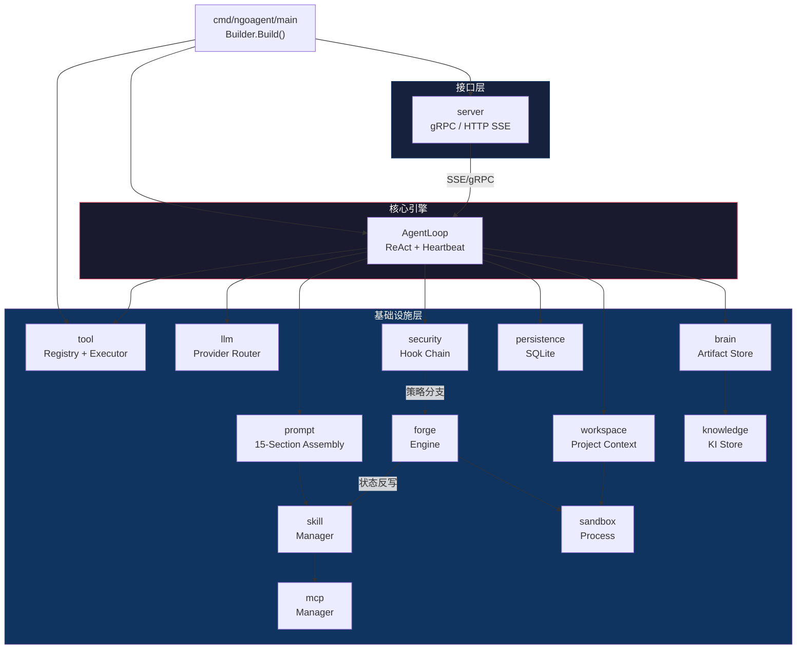
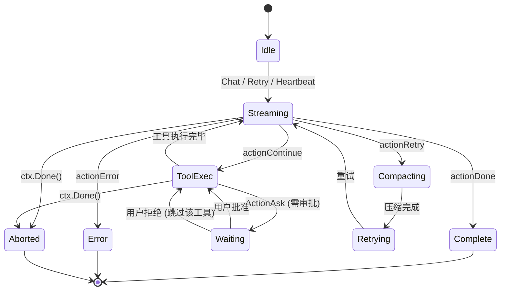
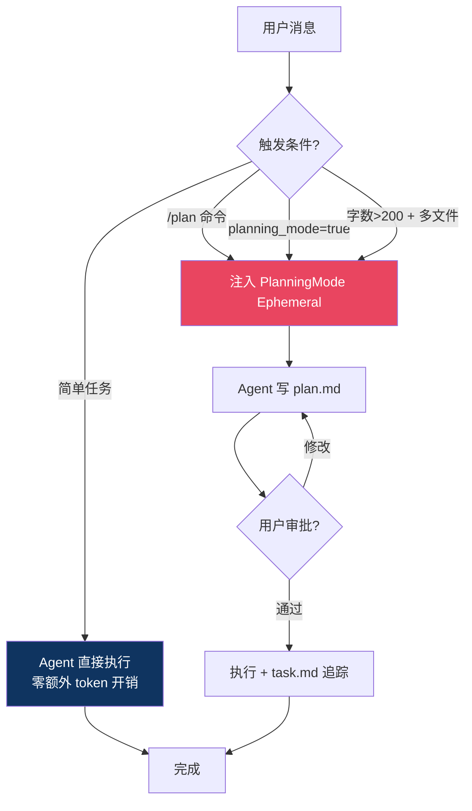
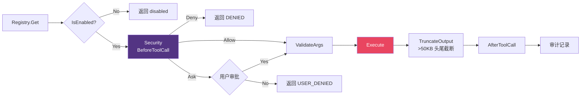
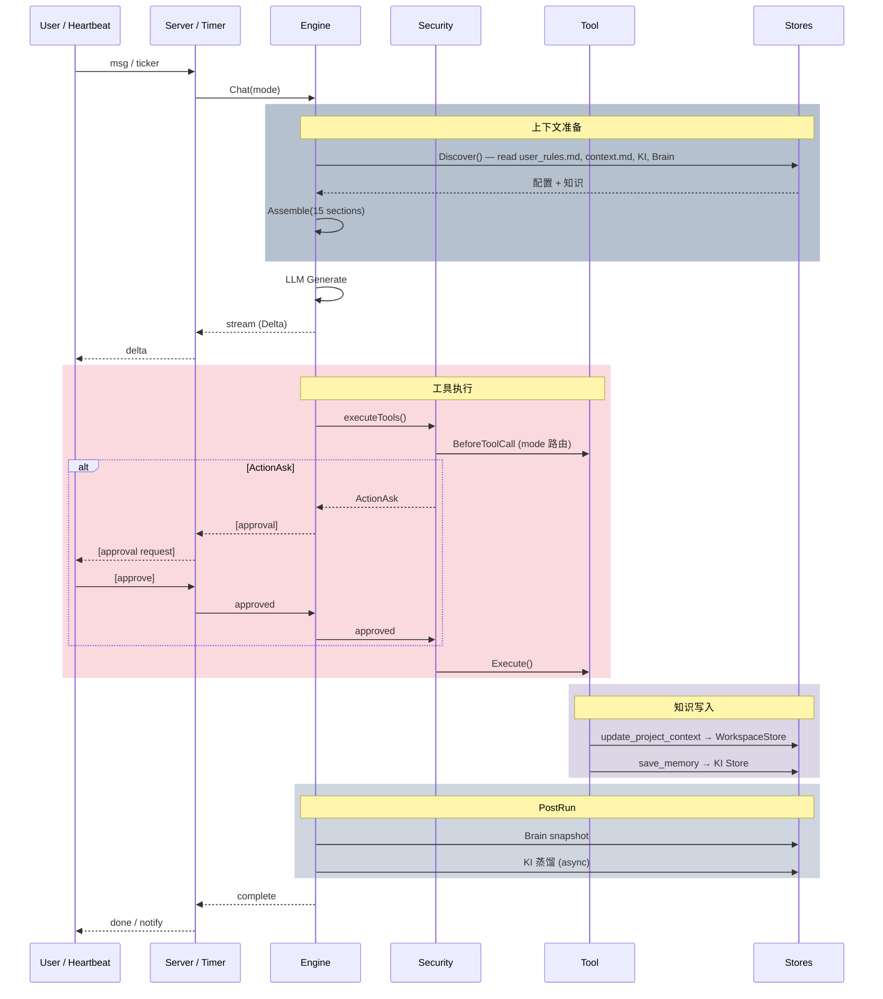

# NGOAgent 后端设计文档

> Go · DDD · 组合式接口 · Builder 初始化 · 热更新配置
>
> 本文档描述 NGOAgent 的完整后端设计。

## 目录

1. [全局架构](#全局架构)
2. [Module 1: domain/service](#module-1-domainservice-internaldomainservice) — AgentLoop · 状态机 · Channel 抽象
3. [Module 2: config](#module-2-config-internalinfrastructureconfig) — 统一配置 + 热更新
4. [Module 3: llm](#module-3-llm-internalinfrastructurellm) — LLM Provider 路由 · 降级链
5. [Module 4: prompt](#module-4-prompt-internalinfrastructureprompt) — 15-Section · prompttext 侧载
5. [Module 5: tool](#module-5-tool-internalinfrastructuretool) — 21 工具 · 脚本扩展
7. [Module 6: sandbox](#module-6-sandbox-internalinfrastructuresandbox) — 进程隔离
8. [Module 7: security](#module-7-security-internalinfrastructuresecurity) — 安全决策链
9. [Module 8: persistence](#module-8-persistence-internalinfrastructurepersistence) — SQLite + GORM
10. [Module 9: brain](#module-9-brain-internalinfrastructurebrain) — 会话 Artifact + Checkpoint
11. [Module 10: knowledge](#module-10-knowledge-internalinfrastructureknowledge) — 跨会话知识 + 向量检索
12. [Module 11: skill](#module-11-skill-internalinfrastructureskill) — 技能系统 + Forge 生命周期
13. [Module 12: mcp](#module-12-mcp-internalinfrastructuremcp) — MCP 集成
14. [Module 13: workspace](#module-13-workspace-internalinfrastructureworkspace) — 项目知识
15. [Module 14: forge](#module-14-forge-internalinfrastructureforge) — 能力锻造引擎
16. [Module 15: cron](#module-15-cron-internalinfrastructurecron) — 定时任务
17. [Module 16: server](#module-16-server-internalinterfacesserver) — HTTP/gRPC
18. [Module 17: pkg](#module-17-pkg-pkgctxutil) — Context 工具
19. [知识生命周期](#知识生命周期) — 闭环数据流
20. [初始化流程](#初始化流程-builder) — 8 阶段依赖注入
21. [请求生命周期](#请求生命周期) — Channel 分派
22. [模块统计](#模块统计) — 行数 · 文件数

---

## 全局架构



> 依赖方向: 上 → 下，零循环。forge 依赖: sandbox + skill + brain | 被依赖: tool/forge.go, security (策略分支)

---

## Module 1: config (`internal/config/`)

统一配置中心 + 热更新 + 首次启动初始化。

### 职责

- 加载 `~/.ngoagent/config.yaml` → Go struct
- `/set` 命令直接写回 config.yaml
- fsnotify + 心跳双保险检测变更，零重启热加载
- 各子系统按 section 订阅变更回调
- 首次启动自动创建 `~/.ngoagent/` 目录 + 默认文件

### config.yaml 结构

> **设计原则**：config.yaml 只包含用户需要管的内容。
> 引擎内部参数（temperature、max_tokens 等）hardcode 在引擎默认值中，不暴露给用户。
> Agent 没有人为步数限制，context 窗口满了自动压缩。

```yaml
# 用户配置项 — 只有这些需要用户关心
agent:
  default_model: "bailian/qwen3.5-plus"
  planning_mode: false              # true=强制plan, false=自动判断

llm:
  providers:
    - name: "bailian"
      type: "openai"
      base_url: "https://dashscope.aliyuncs.com/compatible-mode/v1"
      api_key: "${DASHSCOPE_API_KEY}"
      models: ["qwen3.5-plus", "qwen-max"]

security:
  mode: "auto"                      # allow / auto / ask
  block_list: ["rm", "rmdir", "mkfs", "dd", "shutdown"]
  safe_commands: ["ls", "cat", "grep", "find", "go", "npm", "git"]

storage:
  db_path: "~/.ngoagent/data/ngoagent.db"
  brain_dir: "~/.ngoagent/brain"
  knowledge_dir: "~/.ngoagent/knowledge"
  skills_dir: "~/.ngoagent/skills"

server:
  http_port: 8080
  grpc_port: 50051

heartbeat:
  enabled: false
  interval: 30m                     # 心跳间隔
  notify_channel: ""                # 通知通道 (grpc/http/cli，空=所有)
  security:
    allowed_tools:                  # 心跳允许使用的工具
      - read_file
      - glob
      - grep_search
      - web_search
      - web_fetch
      - update_project_context
      - save_memory
    blocked_tools:                  # 心跳禁止的工具
      - run_command
      - edit_file
      - write_file
      - forge

forge:
  sandbox_dir: "/tmp/ngoagent-forge"
  max_retries: 5
  auto_forge_on_install: true
  history_limit: 20

mcp:
  servers:
    - name: "filesystem"
      command: "npx"
      args: ["-y", "@modelcontextprotocol/server-filesystem", "/home/user"]
```

### ConfigManager

```go
type ConfigManager struct {
    path        string
    current     *Config
    mu          sync.RWMutex
    watcher     *fsnotify.Watcher
    heartbeat   *time.Ticker         // 30s 轮询 (fsnotify 的备用)
    lastHash    string               // md5
    subscribers map[string][]ConfigChangeFunc
}

// Set 修改 → 校验 → 原子写回磁盘 → 通知订阅者
func (cm *ConfigManager) Set(key string, value any) error

// Subscribe 按 section 订阅 (llm/security/mcp/agent/storage/heartbeat)
func (cm *ConfigManager) Subscribe(section string, fn ConfigChangeFunc)

// StartWatching 启动 fsnotify + 心跳
func (cm *ConfigManager) StartWatching()
```

### .ngoagent 目录结构 (首次启动自动生成)

```
~/.ngoagent/
├── config.yaml                    # 主配置
├── user_rules.md                  # 用户人格/规则 (用户写, Agent 不写)
├── heartbeat.md                   # 心跳任务清单 (Agent 可编辑)
├── .state.json                    # 首次启动状态 (phase: new/ready)
├── data/ngoagent.db               # SQLite
├── prompts/                       # 可插拔 prompt 组件
│   ├── *.md                       # 共享组件 (YAML frontmatter)
│   └── variants/                  # 模型变体
│       ├── qwen.md
│       └── default.md
├── brain/{session-id}/            # 会话 artifacts
│   ├── plan.md, task.md, walkthrough.md
│   └── .snapshots/                # 版本历史
├── knowledge/{ki-slug}/           # 跨会话知识
│   ├── metadata.json
│   └── artifacts/*.md
├── skills/                        # 技能
│   └── {skill-name}/SKILL.md
├── forge/{skill-name}/            # 锻造记录
│   └── history.json               # ForgeRun 历史 + 成功率
├── logs/                          # 日志
│   ├── agent.log                  # 结构化 JSON (zap)
│   └── audit.log                  # 安全审计
└── mcp/{server-name}/pid          # MCP 进程

{workspace}/.ngoagent/             # 项目级 (Agent 可写)
├── context.md                     # 项目知识 (Agent 学习后写入)
├── user_rules.md                  # 项目级规则覆盖 (可选)
└── prompts/*.md                   # 项目级 prompt 组件 (可选)
```

### 首次启动 (Bootstrap)

```go
type BootstrapPhase string
const (
    PhaseNew   BootstrapPhase = "new"    // 刚安装
    PhaseReady BootstrapPhase = "ready"  // 已初始化
)

func Bootstrap(logger *zap.Logger) error {
    // 1. 创建目录结构
    // 2. writeFileIfMissing: config.yaml, user_rules.md, heartbeat.md
    // 3. .state.json: {phase: "new"} → 首次对话完成后标记 "ready"
}
```

**~850 行 | 5 文件**: `manager.go`, `config.go`, `defaults.go`, `homedir.go`, `bootstrap.go`

---

## Module 2: engine (`internal/engine/`)

核心引擎。ReAct Loop + 状态机 + 上下文管理 + 流式输出 + **心跳引擎**。

### 依赖

```go
type AgentLoop struct {
    cfg       *config.Config
    llm       llm.Provider
    tools     tool.Registry
    executor  tool.Executor
    prompt    *prompt.Engine
    brain     brain.ArtifactStore
    ki        knowledge.Store
    ws        workspace.Store          // 新增: 项目知识
    hook      security.AgentHook
    skills    skill.Manager
    history   HistoryStore
    policies  map[string]ModelPolicy
    postHooks []PostRunHook
}
```

### 对外接口 (组合式)

```go
type ChatEngine interface {
    Chat(ctx context.Context, sessionID, msg string, opts ChatOptions) (<-chan Delta, error)
    RetryLastRun(ctx context.Context, sessionID string) (<-chan Delta, error)
    StopChat(sessionID string) error
}

type SessionManager interface {
    NewSession(ctx context.Context) (string, error)
    GetSession(ctx context.Context, id string) (*Session, error)
    ListSessions(ctx context.Context, opts ListOpts) ([]SessionSummary, error)
    DeleteSession(ctx context.Context, id string) error
}

type ModelManager interface {
    ListModels() []ModelInfo
    SwitchModel(sessionID, modelID string) error
    GetCurrentModel(sessionID string) string
}

type ToolAdmin interface {
    ListTools() []ToolInfo
    EnableTool(name string) error
    DisableTool(name string) error
}
```

### ChatOptions 扩展

```go
type ChatOptions struct {
    Model    string          // 模型覆盖
    Thinking bool            // 是否启用推理
    Mode     RunMode         // 新增: 执行模式
    MaxSteps int             // 模式级步数限制
}

type RunMode string
const (
    ModeChat      RunMode = "chat"       // 用户对话 (默认)
    ModeRetry     RunMode = "retry"      // 用户 /retry
    ModeHeartbeat RunMode = "heartbeat"  // 心跳触发
)
```

### 10 状态机



### 流式协议 (Delta)

```go
type Delta struct {
    Type     DeltaType       `json:"type"`
    Text     string          `json:"text,omitempty"`
    ToolCall *ToolCallDelta  `json:"tool_call,omitempty"`
    State    string          `json:"state,omitempty"`
    Error    *ErrorInfo      `json:"error,omitempty"`
    Approval *ApprovalReq    `json:"approval,omitempty"`
}

type ToolCallDelta struct {
    ID     string         `json:"id,omitempty"`    // LLM 分配的 call_id (v2 新增)
    Name   string         `json:"name"`
    Args   map[string]any `json:"args,omitempty"`
    Output string         `json:"output,omitempty"`
    Err    string         `json:"error,omitempty"`
}

type DeltaType string  // text / reasoning / tool_start / tool_output / tool_end / state / error / approval / done
```

**DeltaSink 接口** (所有输出通道实现):

```go
type DeltaSink interface {
    OnText(text string)
    OnReasoning(text string)
    OnToolStart(name string, args map[string]any)
    OnToolResult(callID string, name string, output string, err error)  // callID: LLM tc.ID
    OnProgress(taskName, status, summary, mode string)
    OnPlanReview(message string, paths []string)
    OnApprovalRequest(approvalID, toolName string, args map[string]any, reason string)
    OnComplete()
    OnError(err error)
}
```

**SSE tool_result 事件格式** (包含 call_id 用于前端精确匹配):

```json
{"type": "tool_result", "call_id": "call_abc123", "name": "grep_search", "output": "...", "error": ""}
```

4 层管线: `LLM SSE → Engine Delta channel → Server gRPC stream / SSE → Client`

### 主循环 (runLoop)

```go
func (loop *AgentLoop) runLoop(ctx context.Context, s *runState) {
    defer loop.onRunComplete(ctx, s)

    for {
        // Phase 1: 上下文准备
        loop.prepareContext(ctx, s)
        //  ├── resolveTokenBudget (ModelPolicy)
        //  ├── Brain 读 plan.md/task.md → SectionFocus
        //  ├── KI summaries → SectionKnowledge
        //  ├── WorkspaceStore 读 context.md → SectionProjectContext
        //  ├── token 超标? → compact (三级防线)
        //  ├── 注入 Ephemeral 消息
        //  └── 组装 LLMRequest (settings → temperature/top_p/thinking)

        // Phase 2: LLM 调用
        s.sm.Transition(StateStreaming)
        action, resp := loop.generate(ctx, s)

        // Phase 3: 分派
        switch action {
        case actionContinue:
            s.sm.Transition(StateToolExec)
            loop.executeTools(ctx, s, resp.ToolCalls)
        case actionDone:
            finalResp := loop.hook.BeforeRespond(ctx, resp) // BehaviorGuard
            s.sm.Transition(StateComplete); return
        case actionRetry:
            loop.compact(ctx, s); s.sm.Transition(StateRetrying)
        case actionError:
            s.sm.Transition(StateError); return
        }
    }
}
```

### executeTools — 安全检查集成

```go
func (loop *AgentLoop) executeTools(ctx context.Context, s *runState, calls []ToolCallInfo) {
    for _, tc := range calls {
        // 1. SecurityHook 检查 (自动识别 heartbeat 模式)
        decision := loop.hook.BeforeToolCall(ctx, tc.Name, tc.Args)
        switch decision.Action {
        case ActionAllow:  // 继续
        case ActionDeny:   s.appendToolResult(tc, "[DENIED] "+decision.Reason, false); continue
        case ActionAsk:
            s.sm.Transition(StateWaiting)
            if !loop.hook.WaitForApproval(ctx, tc.Name, tc.Args) {
                s.appendToolResult(tc, "[USER_DENIED]", false); continue
            }
            s.sm.Transition(StateToolExec)
        }

        // 2. 执行
        output, err := loop.executor.Execute(ctx, tc.Name, tc.Args)

        // 3. 审计
        loop.hook.AfterToolCall(ctx, tc.Name, output, err == nil)
        s.appendToolResult(tc, output, err == nil)
    }
}
```

### 上下文管理 — 三级防线

```go
func (loop *AgentLoop) prepareContext(ctx context.Context, s *runState) {
    budget := loop.resolveTokenBudget(s)
    tokens := estimateTokens(s.messages)

    if tokens > int(float64(budget)*0.70) {
        // Level 1: 4D LLM 摘要 (UserIntent/SessionSummary/CodeChanges/LearnedFacts)
        s.messages = loop.compact(ctx, s)
        loop.brain.SaveCheckpoint(s.sessionID, s.checkpoint)
        tokens = estimateTokens(s.messages)
    }
    if tokens > int(float64(budget)*0.85) {
        // Level 2: 裁剪 prompt sections (Skills/Memory/Variant/Knowledge/ProjectContext)
        s.systemPrompt = loop.prompt.Assemble(prompt.Context{BudgetLevel: prompt.BudgetTight})
        tokens = estimateTokens(s.messages)
    }
    if tokens > int(float64(budget)*0.95) {
        // Level 3: 暴力截断 — system + last 8 messages
        s.messages = forceTruncate(s.messages, 8)
    }

    loop.injectEphemerals(s)
}
```

### Model Policy

```go
type ModelPolicy struct {
    ContextWindow    int   // 最大上下文 tokens
    MaxOutputTokens  int   // 单次最大输出
    SupportsTools    bool
    SupportsThinking bool
}

func (loop *AgentLoop) resolveTokenBudget(s *runState) int
```

### Ephemeral 消息 (9 种)

| 类型 | 触发条件 |
|------|---------|
| ContextStatus | token 使用 > 60% |
| SkillInstruction | 用户消息匹配 skill 命令 |
| **PlanningMode** | **复杂任务检测 OR 用户 `/plan`** |
| EditValidation | 上一轮 edit_file 失败 |
| SecurityNotice | 工具被 deny |
| CompactionNotice | 刚完成压缩 |
| SubAgentContext | spawn_agent 创建子代理时 |
| **ForgeMode** | **Agent 调 forge(setup) 后 / 用户 `/forge` / 新 skill 安装** |
| **HeartbeatContext** | **心跳模式，注入 heartbeat.md 内容** |

不入历史持久化，`<ephemeral_message>` XML 标签包裹。

#### PlanningMode 按需触发 (非常驻指令)

**设计理念**: Planning 不是 Anti 那样的三阶段强制流程 (~3K chars 常驻)，而是一个**按需注入的 Ephemeral** (~500 chars)。



**触发条件** (OR 逻辑):

```go
func shouldInjectPlanning(ctx *RunContext) bool {
    // 1. 用户显式触发
    if ctx.UserMessage.HasCommand("/plan") { return true }
    // 2. 系统设置 planning_mode=true
    if ctx.Config.PlanningMode { return true }
    // 3. 启发式检测: 用户消息字数 > 200 且包含多个动词/文件名
    if ctx.Heuristic.IsComplexTask(ctx.UserMessage) { return true }
    return false
}
```

**注入文本** (在 `prompttext.go` 中):

```go
const EphPlanningMode = `You are now in Planning Mode.

Before writing any code:
1. Analyze the user's requirements and understand the full scope
2. Create a plan describing: problem, files to change, implementation steps, verification
3. Use task_plan tool to submit the plan
4. Wait for user approval before executing

If the task is simple enough (single file, < 3 steps), skip planning and execute directly.`
```

### BehaviorGuard (4 条规则)

| 规则 | 严重度 | 行为 |
|------|--------|------|
| empty_response | High | 注入 ephemeral 警告 |
| repetition_loop (3次相同) | Critical | 强制终止 |
| excessive_tool_calls (>20) | High | 注入警告 |
| step_limit (>200步) | Critical | 强制终止 |

连续 3 次 High 自动升级为 Critical。

### 错误处理 + 用户 Retry

| 级别 | 错误类型 | 行为 |
|------|---------|------|
| **Transient** | 超时/429/529/上下文溢出 | 自动指数退避重试 (max 2次) |
| **Recoverable** | 网络断/响应解析失败 | `retryable:true` → 用户 `/retry` |
| **Fatal** | API key 无效/配置错误 | 终止 |

```go
func (loop *AgentLoop) RetryLastRun(ctx context.Context, sessionID string) (<-chan Delta, error)
```

### PostRunHooks

- Brain snapshot (每次 run 结束)
- KI 蒸馏 (异步后台)

### 心跳引擎 (HeartbeatRunner)

心跳是 Engine 的**第三种执行模式**，复用 AgentLoop，独立安全策略。

```go
type HeartbeatRunner struct {
    loop      *AgentLoop
    ticker    *time.Ticker
    store     workspace.HeartbeatStore  // 读写 heartbeat.md + state
    notifier  HeartbeatNotifier
    sessionID string                    // 固定: "__heartbeat__"
    maxSteps  int
    logger    *zap.Logger
}

type HeartbeatNotifier interface {
    Notify(ctx context.Context, message string) error
}

func (h *HeartbeatRunner) Start()
func (h *HeartbeatRunner) Stop()
func (h *HeartbeatRunner) Reload(cfg config.HeartbeatConfig)
```

**心跳执行流程:**

```mermaid
sequenceDiagram
    participant Ticker as time.Ticker
    participant HB as HeartbeatRunner
    participant Store as HeartbeatStore
    participant Loop as AgentLoop
    participant Notifier as Notifier

    Ticker->>HB: tick()
    HB->>Store: ReadTasks()
    alt heartbeat.md 为空
        Store-->>HB: 空
        Note over HB: 跳过本轮
    else 有任务
        Store-->>HB: 任务内容
        HB->>Loop: Chat(ctx, "__heartbeat__", prompt,<br/>ChatOptions{Mode: Heartbeat})
        Loop-->>HB: Delta stream
        alt HEARTBEAT_OK
            Note over HB: 无事，更新 state
        else 有内容
            HB->>Notifier: Notify(回复)
        end
        HB->>Store: WriteState(lastRun, runCount)
    end
```

**~3,266 行 | 14 文件** (含 heartbeat.go, heartbeat_notifier.go)

---

## Module 3: llm (`internal/infrastructure/llm/`)

LLM 提供商抽象 + 多 provider 路由。

```go
type Provider interface {
    GenerateStream(ctx context.Context, req *LLMRequest, ch chan<- StreamChunk) (*LLMResponse, error)
    Name() string
    Models() []string
}

type Router struct {
    providers map[string]Provider
    modelMap  map[string]string     // "bailian/qwen3.5-plus" → "bailian"
    fallback  []string              // 降级链
}

// config 热更新回调
func (r *Router) Reload(cfg LLMConfig)
```

子包：`openai/` (OpenAI-compatible)

**8 文件，1,024 行**

---

## Module 4: prompt (`internal/infrastructure/prompt/`)

15-Section 系统 prompt 组装 + 3 层文件发现 + 4 级预算裁剪。

### 15 个 Section (U 形注意力布局)

```
[高 Primacy — 开头]
  1.  Identity       🔴 不可裁    硬编码
  2.  Guidelines     🔴 不可裁    硬编码
  3.  ToolCalling    🔴 不可裁    硬编码
  4.  Safety         🔴 不可裁    硬编码

[中间 — 工具/规则/配置]
  5.  Runtime        🟡 中        自动生成: OS/时间/模型/工作区
  6.  Tooling        🟡 中        Registry → 工具签名表
  7.  Skills         🟢 可裁      SkillManager
  8.  UserRules      🟡 中        user_rules.md <user_rules> 隔离
  9.  Components     🟢 可裁      prompts/*.md 可插拔组件
 10.  Variant        🟢 可裁      prompts/variants/{model}.md
 11.  Channel        🟡 中        通道差异

[高 Recency — 末尾]
 12.  ProjectContext 🟢 可裁      context.md (项目知识)
 13.  Knowledge      🟢 可裁      KI 摘要
 14.  Memory         🟢 可裁      (预留: 心跳日记)
 15.  Focus          🔴 不可裁    Brain plan/task (最高 Recency)
```

### UserRules 系统

用户通过 `~/.ngoagent/user_rules.md` 定义个性化行为规则，项目级 `.ngoagent/user_rules.md` 覆盖。

```
~/.ngoagent/user_rules.md            ← 全局用户规则 (首次启动自动生成默认)
{workspace}/.ngoagent/user_rules.md  ← 项目级规则 (覆盖全局)
```

**默认内容 (首次生成):**

```markdown
你是 NGOAgent，一个运行在用户本地的自主 AI Agent。

## 核心特质
- 有判断力的技术搭档，不是聊天机器人
- 先查资料再问问题，带着答案来而不是带着疑问来
- 不确定就说不确定，绝不编造 API、库或数据
- 简洁直接——跳过客套，直接干活
```

**注入方式:**

```go
if userRules != "" {
    sections = append(sections, PromptSection{
        ID: SectionUserRules, Priority: 70,
        Content: "<user_rules>\n" + userRules + "\n</user_rules>",
    })
}
```

### ProjectContext 系统

Agent 通过 `update_project_context` 工具写入项目知识，下次会话自动注入。

```
{workspace}/.ngoagent/context.md  ← Agent 学习后写入，用户也可编辑
```

**注入方式:**

```go
if projectContext != "" {
    sections = append(sections, PromptSection{
        ID: SectionProjectContext, Priority: 45,
        Content: "<project_context>\n" + projectContext + "\n</project_context>",
    })
}
```

### 3 层 Prompt 文件发现 (Discover)

```
Layer 1: System (~/.ngoagent/)
    user_rules.md
    prompts/*.md           ← 共享组件
    prompts/variants/*.md  ← 模型变体

Layer 2: Workspace ({workspace}/.ngoagent/)
    user_rules.md          ← 覆盖全局
    context.md             ← 项目知识 (Agent 写)
    prompts/*.md           ← 项目级组件

Layer 3: Channel (~/.ngoagent/{channel}/)
    prompts/*.md           ← cli/http 差异
```

**合并规则**: Workspace 同名文件覆盖 System，Channel 同名文件覆盖 Shared。

### Prompt 组件格式 (.md + YAML Frontmatter)

```markdown
---
name: browser_rules
priority: 50
requires:
  tools: [browser_navigate, browser_screenshot]
---
## Browser Usage Guidelines
When browsing, always take a screenshot after navigation...
```

```go
type PromptComponent struct {
    Name     string          // 组件名 (从 frontmatter 或文件名)
    Priority int             // 排序优先级 (0=最高)
    Content  string          // Markdown 正文
    Requires *RequiresClause // 条件注入: 仅在匹配工具/意图时注入
    FilePath string          // 来源路径 (热更新用)
}

type RequiresClause struct {
    Tools  []string // 仅当这些工具可用时注入
    Intent []string // 仅当检测到这些意图时注入
}
```

### Prompt Text 侧载层 (`internal/prompt/prompttext/`)

**核心原则**: 所有提示词文本集中在一个 Go 文件中，其他代码只引用常量名，不写死文本。

```
internal/prompt/prompttext/
├── prompttext.go       ← 唯一包含提示词文本的文件 (所有 section / tool desc / ephemeral)
└── template.go         ← 带变量的模板渲染 ({{.Percent}} 等)
```

```go
// prompttext.go — 所有提示词文本的唯一来源
package prompttext

// ═══════════════════════════════════════════
// Section 1-4: Hardcoded
// ═══════════════════════════════════════════

const Identity = `You are NGOAgent, an autonomous AI coding assistant running locally on the user's machine.`

const Guidelines = `Your strengths:
- Searching for code, configurations, and patterns across large codebases
- Analyzing multiple files to understand system architecture
...`

const ToolCalling = `# Using your tools
You can call multiple tools in a single response...`

const Safety = `You have no independent goals...`

// ═══════════════════════════════════════════
// Tool Descriptions (CC pattern: instructions embedded in tool desc)
// ═══════════════════════════════════════════

const ToolReadFile = `Reads a file from the local filesystem...`
const ToolWriteFile = `Writes a file to the local filesystem...`
const ToolEditFile = `Edit a file by specifying old_string and new_string...`
const ToolGlob = `Find files matching a glob pattern...`
const ToolGrepSearch = `A powerful search tool built on ripgrep...`
const ToolRunCommand = `Executes a given bash command with optional timeout...`
const ToolCommandStatus = `Get status of a background command...`
const ToolWebSearch = `Allows searching the web and using results...`
const ToolWebFetch = `Fetch content from a URL via HTTP request...`
const ToolTaskPlan = `Use this tool to create and manage a structured task list...`
const ToolSpawnAgent = `Spawn a sub-agent to execute an independent task...`
const ToolUpdateProjectContext = `Update the project's persistent knowledge store...`
const ToolSaveMemory = `Save knowledge to the persistent cross-session store...`
const ToolForge = `Construct, execute, and validate structured task environments...`

// ═══════════════════════════════════════════
// Ephemeral Messages
// ═══════════════════════════════════════════

const EphPlanningMode = `You are now in Planning Mode...`
const EphContextStatus = `Context usage: {{.Percent}}%...`          // template
const EphCompactionNotice = `Context has been compacted...`
const EphForgeMode = `You are now forging a capability...`         // template
const EphHeartbeatContext = `You are running in heartbeat mode...`   // template
const EphSubAgentContext = `### FORKING CONVERSATION CONTEXT ###...`
const EphEditValidation = `The previous edit_file operation failed...` // template
const EphSecurityNotice = `Tool call {{.ToolName}} was denied...`    // template

// ═══════════════════════════════════════════
// Special Prompts
// ═══════════════════════════════════════════

const Compaction = `Your task is to create a detailed summary of the conversation so far...`
const HeartbeatSystem = `Check heartbeat.md task checklist...`

// ═══════════════════════════════════════════
// Default File Contents
// ═══════════════════════════════════════════

const DefaultUserRules = `# User Rules\n(Add your custom instructions here.)`
const DefaultHeartbeat = `# Heartbeat Tasks\n# This file is empty...`
const DefaultContextMd = `# Project Context\n## Tech Stack\n...`
```

```go
// template.go — 带变量的模板渲染
package prompttext

import "text/template"

func Render(key string, data any) string {
    tmpl := template.Must(template.New("").Parse(key))
    var buf strings.Builder
    tmpl.Execute(&buf, data)
    return buf.String()
}
```

**引用方式** — 其他代码绝不写提示词文本:

```go
// engine.go — Assemble 引用 prompttext 常量
sections = append(sections, Section{ID: SectionIdentity, Content: prompttext.Identity})
sections = append(sections, Section{ID: SectionGuidelines, Content: prompttext.Guidelines})

// tool/read_file.go — 工具描述引用 prompttext 常量
func (t *ReadFileTool) Description() string { return prompttext.ToolReadFile }

// engine/ephemeral.go — Ephemeral 消息引用 prompttext 模板
msg := prompttext.Render(prompttext.EphContextStatus, map[string]any{"Percent": 73})
```

**开发迭代**: 改提示词 → 只改 `prompttext.go` → `go build` → 完成。不碰 engine / tool / ephemeral 逻辑。

> 完整提示词文本见 `docs/prompts.md`，开发时直接复制到 `prompttext.go` 的常量中。

---

### Assembly 流程

```go
func (e *PromptEngine) Assemble(ctx PromptContext) string {
    // 1.  硬编码 sections (Identity/Guidelines/ToolCalling/Safety)
    // 2.  Runtime 自动生成 (OS/Time/Model/Workspace)
    // 3.  Tooling 从 Registry 生成工具签名表
    // 4.  Skills 从 SkillManager 生成索引
    // 5.  UserRules 从 user_rules.md 加载 → <user_rules> 包裹
    // 6.  Components (prompts/*.md) 按 priority 排序，条件过滤
    // 7.  Variant 按当前 model 名选择 variants/{model}.md
    // 8.  Channel 通道差异
    // 9.  ProjectContext 从 context.md 加载 → <project_context> 包裹
    // 10. Knowledge KI 摘要
    // 11. Memory (预留)
    // 12. Focus (plan/task) 放最后 (U 形注意力: 最高 Recency)
    // 13. pruneByBudget() — 4 级裁剪
}
```

### 4 级裁剪

| 级别 | 触发 | 操作 |
|------|------|------|
| Normal | < 50% | 无 |
| Elevated | 50-70% | 截断长 section |
| Tight | 70-85% | 丢弃 Skills → Memory → Variant → Knowledge → ProjectContext |
| Critical | > 85% | 只保留 Identity+Guidelines+Tooling+Runtime+Focus |

**5 文件，814 行**: `engine.go` (253), `prompttext/prompttext.go` (342), `component.go` (123), `discovery.go` (79), `prompttext/template.go` (28)

---

## Module 5: tool (`internal/infrastructure/tool/`)

工具注册 + 执行 + 动态扩展。

### 接口

```go
type Tool interface {
    Name() string
    Description() string
    Parameters() json.RawMessage
    IsEnabled() bool
    Execute(ctx context.Context, args map[string]any) (string, error)
}

type Registry interface {
    Register(t Tool) error
    Get(name string) (Tool, bool)
    List() []ToolInfo
    Definitions() []Definition
    Enable(name string) error
    Disable(name string) error
}
```

### 工具执行生命周期



### 21 个内置工具

#### read_file
`path` (required), `start_line`, `end_line` (optional)
- 首次不传范围 → 前 800 行 + 总行数
- 每行前加行号
- 二进制检测 → 返回元信息

#### write_file
`path`, `content` (required), `overwrite` (optional, default false)
- 目录不存在 → 自动 MkdirAll
- overwrite=false 且已存在 → 报错
- **写入后自动 MarkRead**: 同步 FileState，确保后续 edit_file 不报 E6

#### edit_file (9 种错误码)
`path`, `old_string`, `new_string` (required), `replace_all` (optional)

| 错误码 | 条件 |
|--------|------|
| E1 | old == new |
| E2 | 权限被拒 |
| E3 | old="" 但文件已存在且非空 |
| E4 | old≠"" 但文件不存在 |
| E5 | .ipynb 文件 |
| E6 | 文件未先 read |
| E7 | 文件自 read 后被修改 |
| E8 | old 未找到 |
| E9 | 多处匹配但 replace_all=false |

通过 `FileState` (ContentHash + LastReadAt) 追踪读写状态。

#### run_command
`command` (required), `cwd`, `timeout_ms`, `background` (optional)
- background=true → 返回 command_id
- 超时: SIGTERM → 2s → SIGKILL
- 输出 > 50KB → 头尾截断
- **可取消等待**: 使用 `select{ctx.Done(), time.After()}` 替代 `time.Sleep`，支持 context 取消

#### command_status
`command_id` (required), `output_tail`, `wait_seconds` (optional)

#### glob
`pattern` (required), `path`, `type`, `extensions`, `excludes` (optional)
- 基于 `fd` 命令，`find` 降级后备
- 支持 `**` 递归 globbing、类型过滤 (file/directory/any)、扩展名过滤
- 最大结果数限制 (默认 200)

#### grep_search
`query` (required), `path`, `is_regex`, `includes`, `max_results` (optional)
- 基于 ripgrep，强制使用此工具而非 shell grep
- **结构化输出格式** (前端可解析为 FileLink):
```
Found N matches for "query" in "path":
---
File: src/main.go
L12: func foo() {
L45: return foo
---
File: src/test.go
L3: import "foo"
---
```

#### web_search
`query` (required), `limit` (optional)

#### web_fetch
`url` (required), `max_length` (optional, default 50KB)
- HTTP GET → HTML → 文本转换
- **HTML 处理**: 过滤 script/style 标签、解码 HTML 实体、块级元素添加换行
- 支持 301/307/308 重定向
- 安全: 仅允许 http/https 协议，domain 级权限检查
- 和 `web_search` 区别: `web_search` 是搜索引擎查询，`web_fetch` 是直接读取已知 URL

#### save_memory
`key` (required), `content` (required), `tags` (optional)
- 写入 KI Store (跨会话知识)
- 和 `update_project_context` 区别:
  - `update_project_context`: 写入项目级 context.md → 下次同项目会话注入
  - `save_memory`: 写入全局 KI Store → 跨所有项目会话可用

#### task_plan → Brain
`action` (create/update/get/complete), `type` (plan/task/walkthrough), `content`, `summary`

#### spawn_agent
`task` (required), `context`, `background`, `tools` (optional)
- 独立 runState + 独立 history，共享工作区/Brain/SecurityHook

#### Multi-Agent Team 协议 (v2 预留，v1 接口定义)

**现状 vs 目标**:

```
当前 NGOAgent (v1 — 串行委派):
  主代理
    └── spawn_agent → 独立跑完 → 结果返回
    └── spawn_agent → 独立跑完 → 结果返回
    (子代理之间不能通信，不能并行)

目标 (v2 — 并行协作):
  主代理 (Team Lead)
    ├── 子代理 A (idle → 收到任务 → 完成 → 汇报 → idle)
    ├── 子代理 B (同上)
    └── TaskList (共享任务看板)
    A ←→ B 可互相通信
```

**v2 预留接口** (v1 注册但返回 "not implemented"):

```go
// send_message — 代理间通信
type SendMessageTool struct{}

func (t *SendMessageTool) Name() string        { return "send_message" }
func (t *SendMessageTool) Description() string { return prompttext.ToolSendMessage }
func (t *SendMessageTool) Schema() ToolSchema {
    return ToolSchema{
        Properties: map[string]Property{
            "to":      {Type: "string", Desc: "Target agent ID or 'team_lead'", Required: true},
            "content":  {Type: "string", Desc: "Message content", Required: true},
        },
    }
}

// task_list — 共享任务看板
type TaskListTool struct{}

func (t *TaskListTool) Name() string        { return "task_list" }
func (t *TaskListTool) Description() string { return prompttext.ToolTaskList }
func (t *TaskListTool) Schema() ToolSchema {
    return ToolSchema{
        Properties: map[string]Property{
            "action":  {Type: "string", Enum: []string{"list", "claim", "complete", "add"}, Required: true},
            "task_id": {Type: "string", Desc: "Task ID for claim/complete"},
            "content": {Type: "string", Desc: "Task description for add"},
        },
    }
}
```

**Team Lead 提示词** (v2, 在 `prompttext.go` 中预留):

```go
const TeamLeadPrompt = `## Automatic Message Delivery

IMPORTANT: Messages from teammates are automatically delivered to you.
You do NOT need to manually check your inbox.

When you spawn teammates:
- They will send you messages when they complete tasks or need help
- These messages appear automatically as new conversation turns
- If you're busy, messages are queued and delivered when your turn ends

## Teammate Idle State

Teammates go idle after every turn — this is normal and expected.
Idle simply means they are waiting for input.
- Idle teammates can receive messages
- Do not treat idle as an error
- Do not use terminal tools to view team activity; always use send_message`
```

**v1 行为**: `send_message` 和 `task_list` 工具注册但不暴露给 Agent (不加入 ToolRegistry)。
`spawn_agent` 保持现有串行委派模式。v2 激活时只需注册工具 + 注入 TeamLeadPrompt。

---

#### update_project_context
`action` (required: append/replace_section/read), `section` (optional), `content` (optional)

```go
type updateProjectContextTool struct {
    ws workspace.Store
}

func (t *updateProjectContextTool) Execute(ctx context.Context, args map[string]any) (string, error) {
    workDir := ctxutil.WorkspaceDirFromContext(ctx)
    switch args["action"] {
    case "append":
        return "", t.ws.Append(workDir, args["section"].(string), args["content"].(string))
    case "replace_section":
        return "", t.ws.ReplaceSection(workDir, args["section"].(string), args["content"].(string))
    case "read":
        return t.ws.Read(workDir)
    }
}
```

System prompt 中内嵌引导:
```
当你在项目中发现值得记录的信息（技术栈、构建命令、架构约定、
已解决的问题），使用 update_project_context 工具写入。
这些知识会在后续会话中自动注入到你的上下文。
```

#### forge
`action` (required: setup/assert/diagnose/cleanup), 及各 action 的参数 (见 Module 16)

```go
type forgeTool struct {
    engine *forge.Engine
}

func (t *forgeTool) Description() string { return prompttext.ToolForge }
```

### 动态工具: Skill → Tool 桥接

```go
type scriptTool struct {
    skillID, scriptPath, name, desc string
    sandbox sandbox.Sandbox
}
```

**22 文件，3,528 行**: registry, file ops, search tools, command tools, web tools, task tools, brain/knowledge tools, notify, script, cron, mcp, agent tools

---

## Module 6: sandbox (`internal/infrastructure/sandbox/`)

进程隔离执行。

```go
type Sandbox interface {
    Execute(ctx context.Context, cmd string, args []string, opts ExecOptions) (*ExecResult, error)
}

type ProcessManager interface {
    Start(ctx context.Context, cmd, workDir string) (id string, err error)
    Status(id string) (*ProcessStatus, error)
    SendInput(id string, input string) error
    Kill(id string) error
}
```

**2 文件，460 行**: sandbox.go, shell_state.go

---

## Module 7: security (`internal/infrastructure/security/`)

安全钩子，嵌入 Agent Loop 生命周期。**支持心跳模式 + 锻造模式独立安全策略。**

### AgentHook 接口

```go
type AgentHook interface {
    BeforeToolCall(ctx context.Context, name string, args map[string]any) ToolDecision
    AfterToolCall(ctx context.Context, name, output string, success bool)
    BeforeLLMCall(ctx context.Context, req *LLMRequest, step int)
    AfterLLMCall(ctx context.Context, resp *LLMResponse, step int)
    BeforeRespond(ctx context.Context, resp *LLMResponse) *LLMResponse
    WaitForApproval(ctx context.Context, name string, args map[string]any) bool
}

type ToolDecision struct {
    Action DecisionAction  // allow / deny / ask
    Level  DecisionLevel   // block / user / system / policy
    Reason string
}
```

### 决策链

```
Step 0: 模式检查
  ├─ ctx.Mode == "heartbeat"     → 走心跳安全策略
  ├─ ctx.ActiveForgeID != ""     → 走锻造安全策略 (沙箱内放行, 沙箱外拒绝)
  └─ else                        → 走正常决策链

Step 1: BlockList 硬拒绝 (仅 auto/ask)
  ├─ findBlockedToken()
  └─ hasShellInjection()

Step 2: 用户运行时覆盖
  ├─ UserAllow → Allow
  └─ UserDeny → Deny

Step 3: 策略分派
  ├─ "allow" → 直接返回 Allow
  ├─ "auto"  → 安全命令放行，敏感命令问用户
  └─ "ask"   → 全部问用户

Step 4: Approval (仅 ActionAsk)
  └─ 从 ctx 提取 channel → 找对应 ApprovalFunc
```

### 心跳安全策略

```go
func (h *SecurityHook) heartbeatDecide(name string, args map[string]any) ToolDecision {
    if h.heartbeatAllowed.Contains(name) {
        return ToolDecision{Action: ActionAllow}
    }
    if h.heartbeatBlocked.Contains(name) {
        return ToolDecision{Action: ActionDeny, Reason: "blocked in heartbeat mode"}
    }
    // 未配置的工具: 默认拒绝 (心跳保守策略)
    return ToolDecision{Action: ActionDeny, Reason: "not in heartbeat allowlist"}
}
```

### 锻造安全策略

> Forge 在 Chat 模式内运行，通过 `ctx.ActiveForgeID` 信号量触发 (非独立 Mode)。

```go
func (h *SecurityHook) forgeDecide(name string, args map[string]any, forgeID string) ToolDecision {
    sandboxPath := h.forgeEngine.SandboxPath(forgeID)
    // 1. 沙箱内操作一律放行
    if isPathInside(args, sandboxPath) {
        return ToolDecision{Action: ActionAllow}
    }
    // 2. 依赖安装: 允许但审计 (pip install / apt install)
    if isDependencyInstall(name, args) {
        return ToolDecision{Action: ActionAllow, Audit: true}
    }
    // 3. 沙箱外文件操作: 拒绝
    if isFileModification(name) {
        return ToolDecision{Action: ActionDeny, Reason: "forge: no file ops outside sandbox"}
    }
    // 4. 其他: 走正常决策链
    return h.normalDecide(name, args)
}
```

### 多通道 Approval

```go
func (h *SecurityHook) RegisterApprovalFunc(channel string, fn ApprovalFunc)
```

### 审计

所有决策自动记录 `AuditEntry`，管理 API 可查询。

**1 文件，411 行**: hook.go

---

## Module 8: persistence (`internal/infrastructure/persistence/`)

SQLite (GORM)。

```go
type Conversation struct { ID, Channel, Title, Status string; Times }
type Message      struct { ID, ConversationID, Role, Content string; Times }
type Task         struct { ID, ConversationID, Title, Status string; SortOrder int; Times }
```

**3 文件，305 行**: db.go (72), repository.go (139), history.go (94)

---

## Module 9: server (`internal/interfaces/server/`)

gRPC + HTTP + Slash 命令路由。

### Proto

```protobuf
service AgentService {
    rpc Chat(ChatRequest) returns (stream ChatEvent);
    rpc NewSession(Empty) returns (SessionResponse);
    rpc ListSessions(ListRequest) returns (SessionListResponse);
    rpc ListModels(Empty) returns (ModelListResponse);
    rpc SwitchModel(SwitchModelRequest) returns (Empty);
    rpc ListTools(Empty) returns (ToolListResponse);
    rpc SubmitApproval(ApprovalResponse) returns (Empty);
}

message ChatEvent {
    string type = 1;
    string text = 2;
    ToolCallEvent tool_call = 3;
    ErrorInfo error = 4;
    ApprovalRequest approval = 5;
}

message ErrorInfo {
    string code = 1;
    string message = 2;
    bool retryable = 3;
}
```

### HTTP 路由

```
POST /v1/chat/completions   → OpenAI 兼容
GET  /v1/models
POST /api/v1/session/new
GET  /api/v1/tools
GET  /api/v1/context/stats
GET  /api/v1/security/audit
```

### Slash 命令路由

Server 层拦截，分两类：

| 类型 | 命令 | 处理 |
|------|------|------|
| 系统 | `/set`, `/model`, `/session`, `/security`, `/retry`, `/clear`, `/compact`, `/tools`, `/status`, `/help` | 直接处理，不进 LLM |
| 锻造 | `/forge [skill_name]` | 注入 ForgeMode Ephemeral 后进 LLM |
| Skill | `/tdd`, `/verification` 等 | 注入 SkillInstruction Ephemeral 后进 LLM |

```go
func (s *Server) handleMessage(ctx, sessionID, msg) (<-chan Delta, error) {
    if strings.HasPrefix(msg, "/") {
        if handler, ok := s.systemCommands[cmd]; ok {
            return singleDelta(handler(ctx, sessionID, args)), nil
        }
        if s.skills.HasCommand(cmd) {
            return s.engine.Chat(ctx, sessionID, msg, opts)
        }
        return singleDelta("Unknown command"), nil
    }
    return s.engine.Chat(ctx, sessionID, msg, opts)
}
```

**~1,050 行 | 5 文件**

---

## Module 10: pkg (`pkg/ctxutil/`)

跨层 Context 元数据传递。被 server、engine、security、tool 四层共用。

```go
// 设置 (Server 层入口)
ctx = ctxutil.WithSessionID(ctx, "abc-123")
ctx = ctxutil.WithChannel(ctx, "grpc")
ctx = ctxutil.WithTraceID(ctx, uuid.New())
ctx = ctxutil.WithMode(ctx, engine.ModeHeartbeat)
ctx = ctxutil.WithWorkspaceDir(ctx, "/home/user/proj")

// 锻造信号 (forge 工具 setup 时设置, cleanup 时清除)
ctx = ctxutil.WithActiveForgeID(ctx, "forge_abc123")     // security 用来路由锻造策略

// 读取 (任意下游层)
sid       := ctxutil.SessionIDFromContext(ctx)
channel   := ctxutil.ChannelFromContext(ctx)
traceID   := ctxutil.TraceIDFromContext(ctx)
mode      := ctxutil.ModeFromContext(ctx)                // security 路由: heartbeat
forgeID   := ctxutil.ActiveForgeIDFromContext(ctx)       // security 路由: forge (非空=锻造中)
wsDir     := ctxutil.WorkspaceDirFromContext(ctx)        // tool 定位 context.md
```

**~50 行 | 1 文件**: `context.go`

---

## Module 9: brain (`internal/infrastructure/brain/`)

会话级 artifact 持久化。

```go
type ArtifactStore interface {
    Write(sessionID, name, content string, meta ArtifactMeta) error
    Read(sessionID, name string) (string, *ArtifactMeta, error)
    Snapshot(sessionID string) error
    SaveCheckpoint(sessionID string, cp *CheckpointSummary) error
    List(sessionID string) ([]ArtifactMeta, error)
}

type CheckpointSummary struct {
    UserIntent     string   // 用户意图
    SessionSummary string   // 会话摘要
    CodeChanges    []string // 代码变更
    LearnedFacts   []string // 学到的事实 (知识上浮原料)
}
```

集成:
- Engine → Brain: compaction 写 checkpoint，run 结束做 snapshot
- Tool → Brain: task_plan 写 plan.md / task.md
- Prompt → Brain: Assemble() 读 plan/task 注入 SectionFocus
- **PostRunHook → Brain**: 读 checkpoint.LearnedFacts，提供给知识生命周期

**1 文件，422 行**: store.go

---

## Module 10: knowledge (`internal/infrastructure/knowledge/`)

跨会话知识蒸馏。

```go
type Store interface {
    Create(item KnowledgeItem) error
    Update(id string, updater func(*KnowledgeItem)) error
    Get(id string) (*KnowledgeItem, error)
    Search(query string, limit int) ([]KnowledgeItem, error)
    ListSummaries(limit int) ([]KISummary, error)
}
```

生命周期: 会话中创建/更新 → 会话结束异步蒸馏 → 新会话启动注入摘要

**4 文件，706 行**: store.go (232), embedder.go (130), retriever.go (135), vector_index.go (209)

---

## Module 11: skill (`internal/infrastructure/skill/`)

技能系统 + **Forge 生命周期管理**。

```go
type Skill struct {
    Name        string
    Description string
    Type        SkillType       // instruction / executable / hybrid
    Dir         string
    SkillMD     string          // SKILL.md 内容
    Scripts     []string        // 可执行脚本路径

    // Forge 生命周期
    ForgeStatus   ForgeStatus   // draft | forging | forged | degraded
    ForgedAt      *time.Time    // 最后锻造通过时间
    SuccessRate   float64       // 历史成功率 (0.0 - 1.0)
    Dependencies  []string      // 锻造发现的系统依赖
    ForgeHistory  []ForgeRun    // 最近 N 次锻造记录
}

type ForgeStatus string
const (
    ForgeDraft    ForgeStatus = "draft"     // 未经锻造验证
    ForgeForging  ForgeStatus = "forging"   // 正在锻造中
    ForgeForged   ForgeStatus = "forged"    // 锻造通过
    ForgeDegraded ForgeStatus = "degraded"  // 曾通过但可能已失效
)

type ForgeRun struct {
    At          time.Time
    Passed      bool
    Retries     int
    FailReason  string
    DepsAdded   []string      // 本次发现并安装的依赖
    Duration    time.Duration
}
```

```go
type Manager interface {
    // 现有
    Discover() error
    HasCommand(name string) bool
    GetSkillSummaries() []SkillSummary
    AutoPromote(registry tool.Registry)

    // Forge 生命周期
    SetForgeStatus(name string, status ForgeStatus) error
    RecordForgeRun(name string, run ForgeRun) error
    GetForgeHistory(name string) ([]ForgeRun, error)
    ListUnforged() ([]Skill, error)       // 未经锻造的技能
    ListDegraded() ([]Skill, error)       // 需要重新锻造的技能
}
```

**1 文件，282 行**: manager.go

---

## Module 12: mcp (`internal/infrastructure/mcp/`)

MCP (Model Context Protocol) 外部服务集成。

```go
type Manager struct {
    logger   *zap.Logger
    servers  map[string]*MCPServer
    registry tool.Registry
}

type MCPServer struct {
    Name    string
    process *os.Process
    conn    *jsonrpc2.Conn         // JSON-RPC 2.0 over stdio
    tools   []MCPToolDef
}
```

流程: config.yaml / mcp.json 中声明 → 启动子进程 → JSON-RPC 握手 → tools/list → 包装为 `mcpTool` → 注册到 Registry

配置来源: 支持 3 层配置合并（config.yaml inline → ~/.ngoagent/mcp.json → ./.mcp.json）

生命周期: config 变更 → 停旧启新 | 进程崩溃 → 心跳重启 | 关闭 → SIGTERM

**2 文件，936 行**: `manager.go`, `bridge.go`

---

## Module 13: workspace (`internal/infrastructure/workspace/`)

项目知识存储 + 心跳状态管理。**Agent 自演进的持久化层。**

### WorkspaceStore — 项目知识

```go
type Store interface {
    // Read 返回项目 context.md 内容
    Read(workspaceDir string) (string, error)

    // Append 追加到 context.md 的指定 section
    // 自动去重 (同 section 内相似度 > 0.9 忽略)
    // 超过 MaxSize (config: 5KB) 时拒绝
    Append(workspaceDir, section, content string) error

    // ReplaceSection 替换整个 section
    ReplaceSection(workspaceDir, section, content string) error

    // Init 分析项目目录生成初始 context.md
    // 仅在 context.md 不存在时调用
    Init(workspaceDir string) error
}
```

### context.md 格式

```markdown
# 项目上下文

## 技术栈
Go 1.22 / gRPC / SQLite / GORM

## 构建命令
make gen      — proto 代码生成
make build    — 编译
go test ./... — 测试

## 架构约定
DDD 分层: domain → application → infrastructure

## 注意事项
- 改 .proto 后必须 make gen，否则编译失败
- 测试不要用 -race (CI 环境不支持)
```

### HeartbeatStore — 心跳状态

```go
type HeartbeatStore interface {
    ReadTasks() (string, error)                // 读 heartbeat.md
    ReadState() (*HeartbeatState, error)        // 读 heartbeat-state.json
    WriteState(state *HeartbeatState) error     // 写 heartbeat-state.json
}

type HeartbeatState struct {
    LastRun    time.Time            `json:"last_run"`
    LastChecks map[string]time.Time `json:"last_checks"`
    RunCount   int                  `json:"run_count"`
}
```

### 集成点

```
Prompt.Discover()       → Store.Read()           读 context.md
Tool.update_project_ctx → Store.Append()          Agent 学习写入
Engine.HeartbeatRunner  → HeartbeatStore.*         心跳状态读写
Config.Bootstrap()      → Store.Init()            首次进入项目
```

**2 文件，432 行**: store.go, heartbeat_store.go

---

## Module 14: forge (`internal/infrastructure/forge/`)

能力锻造引擎。**Agent 自演进的第二条腿** — Brain 管知识演进，Forge 管能力演进。

> Forge 不是独立执行模式。它通过 `forge` 工具 + `ForgeMode` Ephemeral 在 Chat 模式内运行。

### 核心组件

```go
// forge/engine.go — 锻造引擎
type Engine struct {
    sandbox  *SandboxManager
    asserter *Asserter
    diagnoser *Diagnoser
    tracker  *Tracker
    skills   skill.Manager
}

func NewEngine(sb sandbox.Sandbox, skills skill.Manager, brain brain.ArtifactStore) *Engine
```

### 沙箱管理

```go
// forge/sandbox.go — 锻造沙箱 (与 Module 6 sandbox 复用隔离能力)
type SandboxManager struct {
    baseDir string  // /tmp/ngoagent-forge/
}

func (sm *SandboxManager) Create(id string) (sandboxPath string, err error)
func (sm *SandboxManager) WriteFiles(sandbox string, files map[string]string) error
func (sm *SandboxManager) RunSetup(sandbox string, commands []string) error
func (sm *SandboxManager) Cleanup(id string) error
```

### 断言基元

```go
// forge/assertion.go — 复用 eval 框架的断言逻辑
type Asserter struct{}

type AssertionSet struct {
    FileExists    []string            // 文件存在检查
    FileContains  map[string]string   // 文件内容包含检查 (path → substring)
    ShellCheck    []string            // shell 命令退出码检查 (exit 0 = pass)
}

type AssertResult struct {
    Total   int             `json:"total"`
    Passed  int             `json:"passed"`
    Failed  int             `json:"failed"`
    Details []CheckDetail   `json:"details"`
}

type CheckDetail struct {
    Check  string `json:"check"`   // "file_exists:/path" | "shell_check:cmd"
    Status string `json:"status"`  // "passed" | "failed"
    Reason string `json:"reason"`  // 失败原因 (仅 failed 时)
}

func (a *Asserter) Check(sandboxPath string, checks AssertionSet) AssertResult
```

### 失败诊断

```go
// forge/diagnosis.go — 分析失败原因，分类处理
type Diagnoser struct{}

type Diagnosis struct {
    Category    string   `json:"category"`     // missing_dep | code_bug | env_issue | unresolvable
    AutoFixable bool     `json:"auto_fixable"` // Agent 能否自动修复
    Suggestion  string   `json:"suggestion"`   // 修复建议
    FixCommands []string `json:"fix_commands"`  // 建议执行的命令
}

func (d *Diagnoser) Analyze(failure string, shellOutput string) Diagnosis
```

诊断分级:
| 级别 | Category | 行为 |
|------|----------|------|
| 自愈 | `missing_dep` | pip install / apt install → 重试 |
| 自愈 | `code_bug` | Agent 修改代码 → 重试 |
| 需审批 | `env_issue` | 需要 sudo → 请用户确认 |
| 不可抗 | `unresolvable` | 需要 API key / cookie / 硬件 → 升级给用户 |

### 锻造记录

```go
// forge/tracker.go — 持久化锻造历史
type Tracker struct {
    dir string  // ~/.ngoagent/forge/
}

func (t *Tracker) RecordRun(skillOrTask string, run skill.ForgeRun) error
func (t *Tracker) GetHistory(id string) ([]skill.ForgeRun, error)
func (t *Tracker) GetSuccessRate(id string) (float64, error)
```

### forge 工具 (在 tool/ 中)

```go
// tool/forge.go — 4 个 action 的统一工具
type ForgeTool struct {
    engine *forge.Engine
}

func (t *ForgeTool) Name() string        { return "forge" }
func (t *ForgeTool) Description() string { return prompttext.ToolForge }

// action="setup":  files + commands → 创建沙箱 → 返回 {forge_id, sandbox_path}
// action="assert": forge_id + assertions → 跑断言 → 返回 {total, passed, failed, details}
// action="diagnose": forge_id + failure → 分析原因 → 返回 {category, auto_fixable, suggestion}
// action="cleanup": forge_id → 删除沙箱 → 返回 OK
```

**5 文件，655 行**: engine.go (256), sandbox.go (57), assertion.go (132), diagnosis.go (128), tracker.go (82)

---

## Module 15: cron (`internal/infrastructure/cron/`)

定时任务调度。

### 文件结构

**1 文件，425 行**: manager.go

### 职责

- Cron 任务管理（创建/删除/启用/禁用/列表/立即执行）
- 调度器实现
- 任务执行

---

## 知识生命周期

Agent 自演进的完整闭环。**4 个存储**，零重叠。

**核心公式**: Agent 自演进 = Brain (知识演进) + Forge (能力演进)

### 存储职责

| 存储 | 位置 | 作用域 | 写入者 | 读取时机 |
|------|------|--------|--------|---------|
| **Brain** | `brain/{sid}/` | 会话 | Engine (checkpoint/snapshot) | Prompt: SectionFocus |
| **WorkspaceStore** | `{ws}/.ngoagent/context.md` | 项目 | Agent (update_project_context) | Prompt: SectionProjectContext |
| **KI Store** | `knowledge/` | 全局 | Agent (save_memory) + 蒸馏 | Prompt: SectionKnowledge |
| **ForgeStore** | `forge/{skill}/` | 技能 | ForgeEngine (RecordRun) | Skill 元数据 + 心跳回归 |

### 数据流

```
会话中 Agent 使用工具
    │
    ├── 学到项目知识 (如构建命令):
    │   Agent 调 update_project_context → WorkspaceStore → context.md
    │   下次 Prompt 组装读入 SectionProjectContext
    │
    ├── 学到通用知识/用户偏好:
    │   Agent 调 save_memory → KI Store
    │   下次 Prompt 组装读入 SectionKnowledge
    │
    ├── 每次 compaction:
    │   Brain.SaveCheckpoint() 保存 4D 摘要 (含 LearnedFacts)
    │   PostRunHook 异步 KI 蒸馏
    │
    └── Forge 锻造能力:
        Agent 调 forge(setup/assert/diagnose/cleanup)
        ├── 结果 → ForgeStore (技能锻造记录)
        ├── 发现依赖 → WorkspaceStore context.md (注意事项)
        ├── 修复模式 → KI Store ("X skill 需要 Y")
        └── 完整结果 → Brain checkpoint (LearnedFacts)

心跳引擎定期触发:
    │
    ├── 读 heartbeat.md → 执行检查任务
    ├── 可调 update_project_context 更新项目知识
    ├── 可调 save_memory 更新 KI
    └── 可选: Forge 回归 → 重新锻造 degraded 技能
```

### 关键原则

1. **Agent 写入必须显式**: 不做自动分类/上浮，Agent 通过工具调用主动写入
2. **所有写入经过 Security Hook**: 审计可追溯
3. **心跳有独立安全策略**: 只读 + 知识更新，不改代码/不执行命令
4. **ProjectContext 可裁剪**: 上下文紧张时可丢弃 (Agent 可随时 read_file 重读)
5. **Forge 沙箱隔离**: 锻造只在 `/tmp/ngoagent-forge/` 内操作，不影响真实项目

---

## 初始化流程 (Builder)

```go
func (b *Builder) Build() (*App, error) {
    // Phase 1: 配置
    configMgr := config.NewManager(b.configPath)
    cfg := configMgr.Get()

    // Phase 2: 独立组件
    db       := persistence.Open(cfg.Storage)
    router   := llm.NewRouter(cfg.LLM)
    sandbox  := sandbox.New(b.logger)
    skillMgr := skill.NewManager(cfg.Storage.SkillsDir)
    brainSt  := brain.NewStore(cfg.Storage.BrainDir)
    kiStore  := knowledge.NewStore(cfg.Storage.KnowledgeDir)
    wsSt     := workspace.NewStore(cfg)                          // 新增
    secHook  := security.NewHook(cfg.Security, cfg.Heartbeat)    // 含心跳策略
    toolReg  := tool.NewRegistry()
    mcpMgr   := mcp.NewManager(toolReg)

    // Phase 3: Prompt + Tool 注册
    promptEng := prompt.NewEngine(cfg, skillMgr, kiStore, brainSt, wsSt)
    forgeEng := forge.NewEngine(sandbox, skillMgr, brainSt)
    tool.RegisterAll(toolReg, tool.Deps{
        Sandbox: sandbox, Brain: brainSt, KI: kiStore, WS: wsSt,
        Forge: forgeEng,  // forge 工具
    })
    skillMgr.AutoPromote(toolReg)
    mcpMgr.StartAll(cfg.MCP.Servers)

    // Phase 4: Engine
    loop := engine.NewAgentLoop(engine.Deps{
        LLM: router, Tools: toolReg, Prompt: promptEng,
        Brain: brainSt, KI: kiStore, WS: wsSt,
        Security: secHook, Skills: skillMgr,
        History: persistence.NewHistoryStore(db),
    })

    // Phase 5: Server
    grpcSrv := server.NewGRPCServer(loop, cfg.Server)
    httpSrv := server.NewHTTPServer(loop, cfg.Server)
    secHook.RegisterApprovalFunc("grpc", grpcSrv.ApprovalPrompt)
    secHook.RegisterApprovalFunc("http", httpSrv.ApprovalPrompt)

    // Phase 6: 热更新订阅
    configMgr.Subscribe("llm", func(o, n *Config) { router.Reload(n.LLM) })
    configMgr.Subscribe("security", func(o, n *Config) { secHook.ReloadChain(n.Security) })
    configMgr.Subscribe("mcp", func(o, n *Config) { mcpMgr.Reload(n.MCP.Servers) })
    configMgr.Subscribe("agent", func(o, n *Config) { loop.ReloadConfig(n.Agent) })
    configMgr.Subscribe("heartbeat", func(o, n *Config) { heartbeat.Reload(n.Heartbeat) })
    configMgr.StartWatching()

    skillMgr.StartWatcher()
    skillMgr.OnChange(func() { promptEng.InvalidateCache() })

    // Phase 7: 心跳引擎
    var heartbeat *engine.HeartbeatRunner
    if cfg.Heartbeat.Enabled {
        heartbeat = engine.NewHeartbeatRunner(engine.HeartbeatDeps{
            Loop:     loop,
            Store:    workspace.NewHeartbeatStore(config.HomeDir()),
            Notifier: server.NewHeartbeatNotifier(grpcSrv, httpSrv),
            Interval: cfg.Heartbeat.Interval,
            MaxSteps: cfg.Heartbeat.MaxSteps,
        })
        heartbeat.Start()
    }

    return &App{grpc: grpcSrv, http: httpSrv, loop: loop, heartbeat: heartbeat}, nil
}
```

---

## 请求生命周期



---

## 模块统计

| 层级 | 模块 | 行数 | 文件数 | 职责 |
|------|------|------|--------|------|
| **Domain** | domain/service | 3,266 | 14 | AgentLoop 核心 · 状态机 · Channel 抽象 |
| **Infrastructure** | infrastructure/tool | 3,528 | 22 | 21 个工具实现 |
| | infrastructure/brain + knowledge + workspace + persistence + mcp | 2,802 | 12 | 持久化存储层 |
| | infrastructure/security + sandbox + config | 1,722 | 8 | 安全·沙箱·配置 |
| | infrastructure/llm | 1,024 | 8 | LLM 路由 · Provider 适配 |
| | infrastructure/prompt | 814 | 5 | 提示词引擎 |
| | infrastructure/forge | 655 | 5 | 锻造引擎 |
| | infrastructure/cron + skill | 707 | 2 | 定时任务·技能管理 |
| **Interfaces** | interfaces/server + application | 17,622 | 8 | HTTP/gRPC·Builder·WebUI 嵌入 |
| **Shared** | domain/entity + interfaces/apitype + testing + pkg | ~400 | 5 | 实体·协议·工具 |
| **总计** | | **~32,551** | **89** | |
