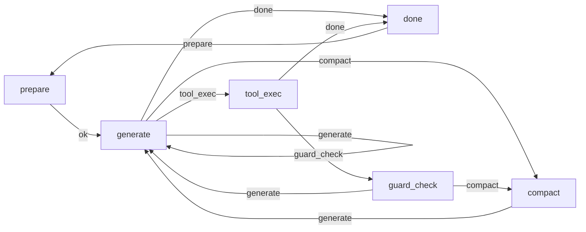

# NGOAgent 内核架构文档

> 基于 30,000 行逐行审计的完整架构参考 | 2026-04-01

---

## 1. 全局架构概览

NGOAgent 采用 **DDD (Domain-Driven Design)** 四层架构：

```
┌─────────────────────────────────────────────────────────┐
│                   interfaces/server/                     │
│    HTTP/SSE (server.go) │ WebSocket (ws_handler.go)      │
│    Slash Commands (doctor.go) │ REST API (routes.go)     │
├─────────────────────────────────────────────────────────┤
│                   application/                           │
│    AgentAPI (api.go) — 统一门面                          │
│    Builder (builder.go) — 7阶段依赖注入                  │
├─────────────────────────────────────────────────────────┤
│                   domain/service/                        │
│    AgentLoop │ GraphRuntime │ BehaviorGuard              │
│    ToolExec │ SecurityMiddleware │ Compact │ Hooks        │
│    Barrier │ RuntimeStateSync │ PersistenceOps │ RunHelpers│
├──────────────────────┬──────────────────────────────────┤
│   domain/tool/       │     infrastructure/               │
│   Protocol │ Meta    │  llm/ │ security/ │ sandbox/      │
│   Signals            │  tool/ │ prompt/ │ persistence/   │
│                      │  mcp/ │ workspace/ │ notify/      │
│                      │  config/ │ knowledge/ │ brain/    │
└──────────────────────┴──────────────────────────────────┘
```

**依赖方向**: `interfaces → application → domain ← infrastructure`
（domain 层不依赖任何外层，infrastructure 通过接口注入）

---

## 2. 构建流程：Builder 7 阶段初始化

`application/builder.go` 是整个系统的中枢布线器，按严格顺序初始化所有组件：

```
Phase 1: Config        加载 config.yaml + env 变量解析
    ↓
Phase 2: Database      SQLite (WAL mode) + GORM AutoMigrate
    ↓
Phase 3: LLM           Provider 构建 → Router → HealthChecker
    ↓
Phase 4: Security      Hook + Classifier (pattern/llm/hybrid)
    ↓
Phase 5: Tools         Registry 注册 37 个内置工具 + MCP 工具
    ↓
Phase 6: Services      AgentLoop deps 组装 (PromptEngine, Guard, etc.)
    ↓
Phase 7: Server        HTTP/WS Server + Auth middleware
```

所有组件通过 `AgentLoop.Deps` 结构体注入：

```go
// loop.go — Deps 核心依赖
type Deps struct {
    LLMRouter       *llm.Router
    ToolExec        ToolExecutor        // infrastructure/tool.Registry
    SecurityHook    SecurityDecider     // security.Hook
    PromptEngine    *prompt.Engine
    HistoryStore    HistoryPersister
    KIStore         KIProvider
    BrainStore      BrainArtifactStore
    EvoStore        EvoPersister
    Guard           *BehaviorGuard
    Workspace       *workspace.Store
    SkillManager    SkillProvider
    TokenTracker    *TokenTracker
    MCPManager      MCPToolProvider
}
```

---

## 3. ReAct 循环引擎

### 3.1 Graph Runtime 合同

当前主执行语义不再由旧状态机定义，而是由 graph runtime 的四类合同定义：

- `Node`: `prepare / generate / tool_exec / guard_check / compact / done`
- `Route`: 节点返回的路由键，驱动边选择
- `Wait`: 仅允许稳定的等待语义，例如 `approval / barrier`
- `Checkpoint`: 运行现场快照，而不是仅保存历史消息

核心图定义位于 `internal/domain/service/graph_runtime.go`，运行时位于 `internal/domain/graphruntime/runtime.go`。



`state.go` 中的 `State` 仍然保留，但现在是 **observed state label**，用于观测、日志和测试断言，不再是最终执行控制源。

### 3.2 主循环 (run.go + 4 sub-files)

当前主入口通过 `run.go` 调用 graph runtime，再由节点处理器承载具体行为。拆分后的文件结构：

```
run.go              (674L) — 主循环 + graph runtime 入口（历史上承载过 doPrepare/doGenerate）
evo_controller.go   (187L) — fireHooks + runEvoEval + pushEvo
persistence_ops.go  (107L) — 增量/全量历史持久化
run_helpers.go      (287L) — buildRuntimeInfo + git snapshot + token estimation + tool tiering
security_middleware.go (97L) — checkSecurity + handleApprovalFlow
```

单次 Run 的执行流：

```
Run(ctx, userMessage)
  │
  ├─ runMu.Lock() — 保证同 loop 不并发
  │
  ├─ transition(Preparing)
  │    └─ prepare node service — 注入 ephemeral messages
  │         ├─ EphemeralBudget 按维度/优先级裁剪
  │         ├─ 注入 workspace context (context.md + @include)
  │         ├─ 注入 KI summaries
  │         └─ 注入 attached files
  │
  ├─ for step := 0; step < maxSteps; step++ {
  │    │
  │    ├─ Guard.Check() — 行为防护检查
  │    │    ├─ 步数限制 (max_steps)
  │    │    ├─ 重复检测 (最后 3 条响应相似度)
  │    │    ├─ 工具循环检测 (最近 N 次同工具)
  │    │    └─ 空响应检测
  │    │
  │    ├─ transition(Generating)
  │    ├─ doGenerate()
  │    │    ├─ buildPromptDeps() — 组装 Prompt sections
  │    │    ├─ PromptEngine.Assemble() — 18-section 组装器
  │    │    ├─ tieredToolDefs() — 3 级工具加载
  │    │    ├─ LLMRouter.ResolveWithFallback()
  │    │    └─ provider.GenerateStream() → SSE/WS delta
  │    │
  │    ├─ if resp.ToolCalls > 0:
  │    │    ├─ transition(ToolExec)
  │    │    ├─ splitToolCalls() — ReadOnly vs SideEffect 分流
  │    │    │    ├─ ReadOnly: execToolsConcurrent() — goroutine 并发
  │    │    │    └─ SideEffect: execToolsSerial() — 逐个执行
  │    │    ├─ checkSecurity() — SecurityMiddleware (security_middleware.go)
  │    │    │    ├─ AccessReadOnly → fast path (skip all checks)
  │    │    │    ├─ Hook.BeforeToolCall → Allow/Deny/Ask
  │    │    │    └─ Ask → handleApprovalFlow (5min timeout)
  │    │    ├─ tool.Execute()
  │    │    ├─ Guard.PostToolRecord()
  │    │    └─ outputSpillover() — >30K 输出截断
  │    │
  │    ├─ if resp.StopReason == "length":
  │    │    └─ outputContinuations++ (max 3 auto-continue)
  │    │
  │    ├─ if resp.StopReason == "stop":
  │    │    ├─ transition(Done)
  │    │    ├─ persistHistory() — 增量持久化
  │    │    ├─ fireHooks() — 异步事件（title distill, KI distill, evo eval）
  │    │    └─ break
  │    │
  │    └─ context overflow detected:
  │         ├─ transition(Compacting)
  │         ├─ doCompact() — 3 级压缩策略
  │         └─ continue
  │  }
  │
  └─ runMu.Unlock()
```

### 3.3 Context 压缩策略 (compact.go)

三级递进策略，确保 context 不超出模型窗口：

```
Level 1: Tool-Heavy 压缩 (~566 行)
  ├─ 密度评估: 按 tokenDensity 排序 messages
  ├─ 超大 tool_result (>2000 char) → 截取 head+tail
  └─ 保留最近 4 条 + system prompt

Level 2: LLM Summary 压缩
  ├─ 选取最旧的 2/3 messages
  ├─ 调用 LLM 生成 "[对话摘要]" 前缀的 summary
  └─ 替换原始 messages 为 summary (compactCount <= 3)

Level 3: Force Truncate
  ├─ compactCount > 3 → 跳过 LLM，直接提取关键信息
  └─ 保留 system + 最近 N 条 + raw extraction
```

---

## 4. 工具系统

### 4.1 工具层次

```
domain/tool/                    infrastructure/tool/
├─ protocol.go  (Signal/Dispatch)   ├─ registry.go     (Registry + 路径解析)
├─ meta.go      (ToolMeta: tier/safety)  ├─ run_command.go   (Shell 执行)
└─ result.go    (ToolResult + SpawnYield) ├─ edit_file.go    (字符串替换 + fuzzy)
                                    ├─ edit_fuzzy.go   (L1→L2→L3 级联匹配)
                                    ├─ read_file.go    (读文件 + line range)
                                    ├─ write_file.go   (写文件)
                                    ├─ grep_search.go  (ripgrep 集成)
                                    ├─ glob.go         (文件查找)
                                    ├─ web_tools.go    (web_search + web_fetch + deep_research)
                                    ├─ agent_tools.go  (spawn_agent + evo)
                                    ├─ git_tools.go    (git 操作)
                                    ├─ knowledge_tools.go (KI CRUD)
                                    ├─ mcp_adapter.go  (MCP 工具桥接)
                                    ├─ manage_cron.go  (定时任务)
                                    ├─ task_list.go    (任务跟踪)
                                    ├─ path_validation.go (symlink 解析 + 敏感路径拦截)
                                    ├─ ... (37 个工具)
                                    └─ schema.go       (工具描述文本常量)
```

### 4.2 三级工具加载 (Tiered Loading)

为减少 system prompt 中的工具定义 token 消耗：

```
Tier 0 — 核心工具 (始终加载):
  read_file, edit_file, write_file, run_command, glob, grep_search,
  web_search, spawn_agent

Tier 1 — 条件加载 (Phase 检测或首次使用后加载):
  git_commit, manage_cron, evo, task_list, deep_research

Tier 2 — 扩展工具 (仅在需要时激活):
  tree, find_files, count_lines, diff_files, http_fetch, clipboard,
  resize_image, view_media
```

### 4.3 Fuzzy Edit Cascade (edit_fuzzy.go)

当 `old_string` 精确匹配失败时：

```
L1: Unicode Normalization
    curly quotes → straight, em-dash → hyphen, NBSP → space

L2: Line-Based TrimEnd (3-pass)
    exact → trimRight → normalize+trimRight
    + trailing empty line removal

L3: Block Anchor Match
    first+last line 作为锚点，中间按 blockSize 匹配

FEEDBACK: findSimilarLines
    如果 L1-L3 全部失败，用 lineSimilarity (>0.6) 返回最相似片段
    作为错误消息的修复建议
```

### 4.4 安全防护链

```
Tool Call
  │
  ├─ SecurityHook.Decide()
  │    ├─ alwaysAllow?  (read_file, glob, grep_search...)  → ALLOW
  │    ├─ isBlocklisted? (rm -rf, curl|bash, eval...)      → ASK
  │    ├─ isSafeCommand? (ls, cat, go build, npm test...)  → ALLOW
  │    ├─ isInWorkspace? (cwd within workspace)            → ALLOW
  │    └─ Classifier.Classify()
  │         ├─ PatternClassifier: regex blocklist → confidence 0.9
  │         ├─ LLMClassifier: 小模型分析 → SAFE/ASK/DANGEROUS
  │         └─ HybridClassifier: Pattern → if conf<0.75 → LLM escalation
  │
  ├─ Decision:
  │    ├─ ALLOW → execute immediately
  │    ├─ ASK   → emit approval_request → block on channel
  │    │          └─ user approves/denies via HTTP/WS
  │    └─ DENY  → return error, transition to Done
  │
  └─ Post-execution:
       ├─ Audit log append (ring buffer, 1000 cap)
       ├─ Webhook notification (if side-effect tool)
       └─ Guard.PostToolRecord()
```

---

## 5. Prompt 引擎 (18-Section Assembly)

`infrastructure/prompt/engine.go` 按 Order 排序组装 system prompt：

```
Order  Section              Source                 Budget
─────────────────────────────────────────────────────────
  1    Core Identity        hardcoded              固定
  2    Operating System     runtime.GOOS           固定
  3    Datetime             time.Now()             固定
  4    Guidelines           hardcoded rules        固定
  5    User Rules           config user_rules      固定
  7    Tooling              tool descriptions      ~4K
  8    Agent Dir            .agent/ context        ~2K
  9    Custom Instructions  workspace context.md   ~3K (可压缩)
 10    Skills               active skill summaries ~2K
 11    KI Summaries         knowledge items        ~6K (budget 动态)
 12    MCP Servers          active MCP server info ~1K
 13    Conv Summary         history compaction     ~2K
 14    Attached Files       user file attachments  ~4K
 15    Runtime Info         git branch, cwd, etc.  ~500
 17    Planning Mode        plan/agentic/auto      ~200
 18    Ephemeral Injections priority-budget merge  ~2K
```

**Budget Pruning**: 总 prompt tokens 接近 context window × compact_ratio 时，
从低优先级 section 开始裁剪（Ephemeral → Conv Summary → KI → Skills）。

---

## 6. LLM 路由与适配

### 6.1 Router 架构

```
Router
├─ providers: map[name]Provider       (多 provider 注册)
├─ modelMap:  map[model]providerName  (模型→provider 映射)
├─ fallback:  []providerName          (故障降级链)
├─ health:    *HealthChecker          (后台心跳探测)
│
├─ Resolve(model) → Provider          (精确查找)
├─ ResolveWithFallback(model)         (fallback 查找，跳过不健康)
├─ SwitchModel(model)                 (切换默认模型)
└─ Reload(providers)                  (热重载，保留 current)
```

### 6.2 StreamAdapter (adapter.go)

SSE 流归一化层 — 将不同 provider 的流式格式统一为 `StreamChunk`：

```
Provider SSE → ChunkMapper.MapChunk() → NormalizedChunk
    ↓
StreamAdapter.Process()
    ├─ thinkParser: <think>...</think> tag 状态机
    │    └─ 流式解析，把 inline think content 路由到 ChunkReasoning
    ├─ Tool call accumulator: 跨 chunk 拼接 arguments JSON
    └─ Output → chan StreamChunk → Delta → SSE/WS writer
```

### 6.3 Error 分类 (errors.go)

```
HTTP Status → ClassifyHTTPError → ClassifyByBody(body 精炼)
    ↓
ErrorLevel:
  ErrorTransient     (429)        → 30s base, 5 retries
  ErrorOverload      (503/529)    → 15s base, 8 retries
  ErrorContextOverflow (400+body) → compact → retry 2x
  ErrorBilling       (402/quota)  → try fallback provider
  ErrorRecoverable   (5xx/network)→ user /retry
  ErrorFatal         (401/403)    → terminate immediately

Background tasks (compact, title): skip retry → avoid amplification
```

---

## 7. Subagent 编排 (Barrier 模式)

```
Parent AgentLoop
  │
  ├─ spawn_agent tool call → SpawnFunc
  │    └─ LoopFactory.Create() → new AgentLoop (isolated history, restricted tools)
  │
  ├─ SubagentBarrier.Register(runID)
  │    ├─ pending++
  │    └─ start timer (default 300s)
  │
  ├─ tool result: SpawnYieldResult
  │    └─ parent loop pauses (transition → Done, but barrier is active)
  │
  ├─ Subagent completes → Barrier.OnComplete(runID, result)
  │    ├─ pending--
  │    ├─ store result
  │    └─ if pending == 0:
  │         ├─ formatResults() → InjectEphemeral
  │         ├─ SignalWake → loopPool.Run(parentSession)
  │         └─ parent auto-resumes with subagent results in context
  │
  └─ Timeout → onTimeout()
       ├─ pending = 0
       ├─ inject partial results + timeout notice
       └─ SignalWake parent
```

---

## 8. SSE/WebSocket 双通道

### SSE 流 (server.go)

```
POST /v1/chat → handleChat
  ├─ BufferedDelta(sseWriter)  — 带 buffer 和 reconnect 能力
  ├─ delta = buf.MakeDelta()
  ├─ runTracker.Register(session, buf)
  ├─ go api.ChatStream(Background, session, msg, delta)
  ├─ select:
  │    case <-done:  → send [DONE]
  │    case <-r.Context().Done():  → buf.Detach() (run continues)
  └─ reconnect: GET /v1/chat/reconnect?session_id=xxx&last_seq=N
       └─ buf.Attach(newWriter, lastSeq) → replay buffered events
```

### WebSocket (ws_handler.go)

```
GET /v1/ws?token=xxx → WebSocket upgrade
  ├─ wsConn.readLoop():
  │    ├─ type: "chat"    → onChat (same as SSE but persistent writer)
  │    ├─ type: "stop"    → api.StopRun()
  │    ├─ type: "approve" → api.Approve()
  │    └─ type: "ping"    → "pong"
  │
  ├─ Key difference: wsWriter lifetime = WS connection lifetime
  │    └─ BufferedDelta 不调 MarkDone — auto-wake 事件通过同一 writer 推送
  │
  └─ wsTracker: sync.Map[sessionID → *wsConn]
       └─ PushEvent(session, type, data) → WS优先, SSE fallback
```

---

## 9. MCP (Model Context Protocol) 客户端

```
Manager
├─ servers: map[name]*Server
│
├─ Start(name, command, args, env)
│    ├─ exec.Command → stdin/stdout pipes
│    ├─ go readLoop(srv)   — Content-Length framed JSON-RPC reader
│    ├─ initialize()
│    │    ├─ "initialize" RPC → server capabilities
│    │    ├─ "notifications/initialized" notification
│    │    └─ Parallel discovery:
│    │         ├─ "tools/list"     → srv.tools
│    │         ├─ "resources/list" → srv.resources
│    │         └─ "prompts/list"   → srv.prompts
│    └─ Register in manager
│
├─ CallTool(name, args)
│    ├─ Route to correct Server by tool name
│    ├─ sendRPC("tools/call", {name, arguments})
│    └─ Parse MCPContent[] → ToolResult
│
├─ Notifications:
│    ├─ "notifications/tools/list_changed" → refreshServer
│    └─ "notifications/resources/list_changed" → (future)
│
└─ JSON-RPC 2.0 over stdio:
     ├─ writeRPC: Content-Length: N\r\n\r\n{jsonrpc...}
     ├─ readFrame: parse Content-Length header → io.ReadFull
     └─ pendingCalls: map[id]*pendingCall (chan-based routing)
```

---

## 10. Evo 自修复引擎

```
条件: agent.plan_mode == "evo" && run 完成

Run completes → fireHooks → runEvoEval (goroutine)
  │
  ├─ Phase 1: Trace Collection
  │    └─ 从 history 提取 TraceStep[] (tool calls + results + errors)
  │
  ├─ Phase 2: LLM Evaluation (evo_evaluator.go)
  │    ├─ 构造评估 prompt → 调用 LLM (可用独立 eval_model)
  │    ├─ 解析 JSON 结果: score, errorType, issues[]
  │    ├─ score > threshold (0.7) → PASS, 无需修复
  │    └─ score ≤ threshold → FAIL, 进入修复
  │
  ├─ Phase 3: Repair Routing (evo_repair.go)
  │    ├─ CircuitBreaker: maxRetries per session
  │    ├─ Strategy selection by errorType:
  │    │    ├─ param_wrong    → param_fix (修正参数)
  │    │    ├─ tool_wrong     → tool_swap (换工具)
  │    │    ├─ intent_mismatch→ re_route (重新理解意图)
  │    │    ├─ quality_low    → iterate (迭代改进)
  │    │    └─ capability_gap → escalate (上报用户)
  │    └─ 注入修复指令 → a.Run(repairCtx, "")
  │
  └─ Persistence: EvoStore (SQLite)
       ├─ EvoTrace      — 执行轨迹
       ├─ EvoEvaluation — 评估结果
       └─ EvoRepair     — 修复记录
```

---

## 11. 持久化层

```
SQLite (WAL mode, GORM)
│
├─ Conversation       — 会话元数据 (id, channel, title, status)
├─ HistoryMessage     — 对话消息 (session_id, role, content, tool_calls)
├─ EvoTrace           — 执行轨迹
├─ EvoEvaluation      — Evo 评估
├─ EvoRepair          — Evo 修复
├─ TokenUsage         — Token 消费记录
└─ Transcript         — 完整对话转录

文件系统:
├─ brain/{session_id}/ — 会话 artifacts
├─ knowledge/{ki_id}/ — Knowledge Items
│    ├─ metadata.json
│    └─ artifacts/
├─ skills/             — Skill 定义 (SKILL.md)
└─ uploads/            — 用户上传文件
```

---

## 12. Sandbox 执行引擎

```
sandbox.Manager
├─ ShellState — 持久化 shell 环境
│    ├─ cwd: 跨命令持久 (cd 效果保留)
│    ├─ envSnapshot: 启动时基线 env
│    ├─ userEnv: 用户 export 的变量 (diff 检测)
│    └─ WrapCommand(): 追加 marker 提取 pwd+env
│         command ; echo CWD_MARKER ; pwd ; echo ENV_MARKER ; env ; echo ENV_END
│
├─ Run(command, cwd, timeout)
│    ├─ bash -lc "wrappedCommand"
│    ├─ Cmd.Env = shellState.BuildEnv()
│    ├─ Cmd.Dir = explicitCwd || shellState.Cwd()
│    ├─ CombinedOutput → ExtractStateFromOutput
│    │    ├─ 解析 marker → 更新 cwd
│    │    ├─ 解析 env diff → 更新 userEnv
│    │    └─ 返回 clean output (去 marker)
│    └─ truncateOutput(100K)
│
├─ RunBackground(id, command, cwd)
│    └─ async exec, output buffered
│
├─ GetStatus(id, waitMs)
│    └─ 查询后台进程状态 + incremental output
│
└─ backgroundProcs: map[id]*bgProcess
     └─ stdout/stderr bytes.Buffer + exitCode + mutex
```

---

## 13. Webhook 通知系统

```
config.yaml:
  notifications:
    webhooks:
      - url: https://hooks.example.com
        events: [complete, error, tool_result]
        secret: "hmac-secret"
        retry: 2

WebhookNotifier
├─ queue: chan WebhookEvent (cap=128, non-blocking emit)
├─ deliver() goroutine:
│    ├─ fan() → 按 event filter 分发到各 target
│    └─ post() → HTTP POST + HMAC-SHA256 签名 + exponential backoff
├─ Close() → drain with 3s deadline
└─ Hook adapter:
     ├─ OnComplete(session)     → type: "complete"
     ├─ OnError(session, err)   → type: "error"
     ├─ OnToolResult(session, tool, output) → type: "tool_result" (仅 side-effect 工具)
     └─ OnProgress(session, task, status)   → type: "progress"
```

---

## 14. 关键并发模型

```
AgentLoop 并发安全:
├─ runMu          — 保证 Run() 不并发 (mutex)
├─ mu             — 保护 history, state, flags (mutex)
├─ cancelFn       — context cancellation for Stop()
└─ Guard          — ✅ sync.Mutex 保护全部 mutable fields (P0-1 fixed)

SubagentBarrier 并发安全:
├─ mu             — 保护 pending/results
├─ finalized      — ✅ 防止 timeout 后迟到 OnComplete 双重触发 (P0-3 fixed)
└─ autoWake       — go autoWake() 异步调用，不在锁内

LoopPool 并发安全:
├─ mu             — 保护 loops map + LRU eviction
├─ per-user 限制  — maxLoopsPerUser
└─ eviction       — TryLock(runMu) 避免驱逐活跃 loop

Tool Registry 并发安全:
├─ RWMutex        — 读多写少 (ListDefinitions vs Register)
├─ CloneWithDisabled — subagent 共享 tools map (只读)
└─ Execute → resolve paths → delegate to Tool.Execute

MCP Manager 并发安全:
├─ Manager.mu     — 保护 servers map
├─ Server.mu      — 保护 running/tools/stdin
├─ Server.pendingMu — 保护 pending RPC calls
└─ readLoop       — 独立 goroutine per server
```

---

## 15. Telemetry 与诊断

```
TelemetryCollector (ring buffer, 1000 events):
├─ Record(TelemetryEvent) — 每次 LLM API 调用后记录
│    └─ model, provider, prompt_tok, complete_tok, latency_ms, error
├─ Stats(n) → P50/P95/P99 latency, success rate, by-model breakdown
└─ /telemetry slash command → human-readable report

TokenTracker:
├─ per-model累计: prompt_tokens, completion_tokens, calls
├─ cost估算: 基于 ModelPolicy 的 PriceInput1K/PriceOutput1K
├─ cache hit rate: 通过 prompt hash fingerprint 估算前缀缓存命中率
└─ /cost slash command → 格式化输出

/doctor 诊断:
├─ LLM connectivity check
├─ Config validation (workspace exists, models configured)
├─ Dependency check (git, ripgrep)
├─ Disk usage (agent home)
└─ Prompt cache hit rate
```

---

## 16. 数据流总览

```
User Message (HTTP/WS)
  │
  ├─ interfaces/server → application/api.ChatStream()
  │    └─ service.AgentLoop.Run(ctx, message)
  │
  ├─ Prepare:
  │    ├─ workspace context + @include resolution
  │    ├─ KI injection (full or semantic topK)
  │    ├─ Ephemeral budget allocation
  │    └─ File attachments
  │
  ├─ Generate:
  │    ├─ PromptEngine.Assemble() → system prompt
  │    ├─ History sanitization
  │    ├─ LLM Router → Provider.GenerateStream()
  │    └─ StreamAdapter → Delta → SSE/WS
  │
  ├─ Tool Execution:
  │    ├─ Security decision → Registry.Execute()
  │    ├─ Sandbox.Run() (commands)
  │    ├─ File I/O (read/write/edit)
  │    ├─ MCP CallTool (external tools)
  │    └─ Results → history append → next iteration
  │
  ├─ Completion:
  │    ├─ History persist (incremental)
  │    ├─ Title distillation (async)
  │    ├─ KI distillation (async, if meaningful)
  │    ├─ Evo evaluation (async, if evo mode)
  │    └─ Webhook notification
  │
  └─ Response:
       └─ Delta events → [DONE] → SSE/WS client
```
