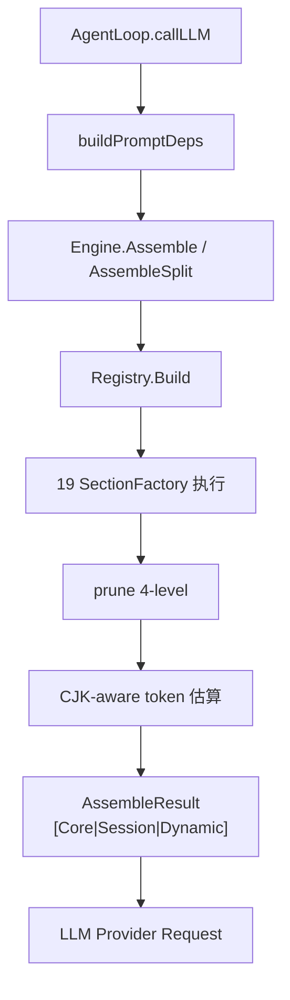
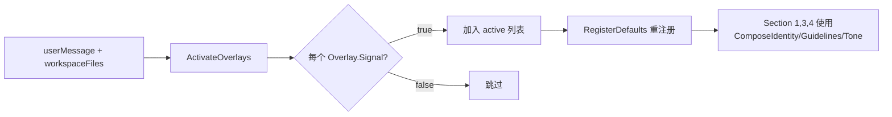

# NGOAgent 提示词架构文档

> **Prompt Version**: v2.2.0 | **Section 数量**: 19 | **Cache Tier**: 3 层 | **审计日期**: 2026-04-07

---

## 1. 架构总览

NGOAgent 的系统提示词采用 **19-Section 动态组装管线**，由 `prompt.Engine` 在每次 LLM 调用前实时构建。核心设计理念：

1. **分层可缓存**：三层 Cache Tier（Core/Session/Dynamic）配合 DashScope cache_control 标记
2. **可组合行为**：Omni 基座 + BehaviorOverlay 叠加层（coding/research 可同时激活）
3. **预算感知裁剪**：4 级 prune 策略，CJK 自适应 token 估算
4. **声明式注册**：Registry 工厂模式，外部可扩展/覆盖任意 Section

```text
┌─────────────────────────────────────────────────────────────────┐
│                    System Prompt Assembly Pipeline               │
│                                                                 │
│  ┌──────────┐    ┌──────────┐    ┌──────────┐    ┌───────────┐ │
│  │ Discovery │───▶│  Deps    │───▶│ Registry │───▶│  Engine   │ │
│  │ (3-layer) │    │ (runtime)│    │ (factory)│    │ (assemble)│ │
│  └──────────┘    └──────────┘    └──────────┘    └─────┬─────┘ │
│                                                        │       │
│                                                        ▼       │
│                                                 ┌────────────┐ │
│                                                 │   Prune    │ │
│                                                 │ (4-level)  │ │
│                                                 └─────┬──────┘ │
│                                                       │        │
│                                         ┌─────────────┴──────┐ │
│                                         │  AssembleResult    │ │
│                                         │  [Core|Session|Dyn]│ │
│                                         └────────────────────┘ │
└─────────────────────────────────────────────────────────────────┘
```

---

## 2. 代码定位

| 模块 | 路径 | 职责 |
|------|------|------|
| **Engine** | `internal/infrastructure/prompt/engine.go` | 19-Section 组装 + 裁剪 + Cache Tier 分段 |
| **Registry** | `internal/infrastructure/prompt/registry.go` | 线程安全的 SectionFactory 注册表 |
| **Discovery** | `internal/infrastructure/prompt/discovery.go` | 3 层文件发现（global/project/variants） |
| **Component** | `internal/infrastructure/prompt/component.go` | 可插拔 .md 组件（YAML frontmatter） |
| **Omni Base** | `internal/domain/profile/omni.go` | 通用身份/行为/语气基座常量 |
| **BehaviorOverlay** | `internal/domain/profile/profile.go` | 行为叠加层接口 + 组合函数 |
| **CodingOverlay** | `internal/domain/profile/coding.go` | 编码行为叠加层实现 |
| **ResearchOverlay** | `internal/domain/profile/research.go` | 研究行为叠加层实现 |
| **PromptText** | `internal/domain/prompttext/prompttext.go` | 静态提示词片段（Safety, Protocol, Format） |
| **Ephemeral** | `internal/domain/prompttext/ephemeral.go` | 逐轮注入消息（规划/上下文/安全） |
| **Conditional** | `internal/domain/prompttext/conditional.go` | ToolContext 条件生成 + 技能预算 |
| **SubAgent** | `internal/domain/prompttext/subagent.go` | 子代理/协调器/多代理团队提示词 |
| **Evo** | `internal/domain/prompttext/evo.go` | 自进化评估系统提示词 |
| **Template** | `internal/domain/prompttext/template.go` | `{{.Var}}` 模板渲染工具 |
| **Deps Builder** | `internal/domain/service/run.go:buildPromptDeps` | 运行时数据采集 → Deps 填充 |
| **Skill Manager** | `internal/infrastructure/skill/manager.go` | 技能发现/分类/触发匹配 |
| **SkillTool** | `internal/infrastructure/tool/skill_tool.go` | skill() 工具 → 内容注入 |

---

## 3. 19-Section 详细定义

### 3.1 Section 结构

```go
type Section struct {
    Order     int    // 组装顺序 (1-19)
    Name      string // 唯一标识符
    Content   string // 渲染后的文本内容
    Priority  int    // 0=必需, 1=高, 2=中, 3=低（用于裁剪）
    Cacheable bool   // 是否可跨轮缓存
    CacheTier int    // 0=动态, 1=核心(不可变), 2=会话(稳定)
}
```

### 3.2 完整 Section 清单

| Order | Name | Priority | CacheTier | 内容来源 | 描述 |
|:-----:|:-----|:--------:|:---------:|:---------|:-----|
| 1 | **Identity** | 0 (必需) | Core | `profile.ComposeIdentity(active)` | Omni 身份 + 活跃叠加层标签 |
| 2 | **CoreBehavior** | 0 (必需) | Core | `profile.OmniBehavior` | 通用能力声明 + 核心规则 |
| 3 | **DoingTasks** | 0 (必需) | Core | `profile.ComposeGuidelines(active)` | 叠加层指南合并（如编码/研究规则） |
| 4 | **ToneAndStyle** | 1 (高) | Core | `profile.ComposeTone(active)` | 语气/格式规则 + 输出效率 |
| 5 | **OutputCapabilities** | 1 (高) | Core | `prompttext.OutputCapabilities` | 前端渲染能力声明 |
| 6 | **Safety** | 0 (必需) | Core | `prompttext.Safety` | 安全/伦理/人类监督规则 |
| 7 | **UserRules** | 1 (高) | Session | `<user_rules>` + Discovery | 用户自定义规则（global + project） |
| 8 | **Tooling** | 0 (必需) | Session | 动态工具摘要 | N 个工具的关键使用说明 |
| 9 | **Skills** | 1 (高) | Session | `FormatSkillsWithBudget()` | 技能列表（3 级降级） |
| 10 | **ToolProtocol** | 0 (必需) | Core | `prompttext.ToolProtocol` | 强制工具使用协议 |
| 11 | **ToolCalling** | 0 (必需) | Core | `prompttext.ToolCalling` | 并行/串行工具调用指引 |
| 12 | **ProjectContext** | 2 (中) | Session | `<project_context>` | 项目上下文（.ngoagent/context.md） |
| 13 | **Variants** | 3 (低) | Session | Discovery (variants/) | 用户自定义提示词变体 |
| 14 | **ResponseFormat** | 0 (必需) | Core | `prompttext.ResponseFormat` | 响应格式规则 |
| 15 | **KnowledgeIndex** | 1 (高) | Dynamic | `<verified_knowledge>` | KI 索引（高可信度） |
| 16 | **SemanticMemory** | 2 (中) | Dynamic | `<working_memory>` | 向量语义记忆（低可信度） |
| 17 | **Runtime** | 1 (高) | Dynamic | OS/时间/模型/工作区 | 运行时环境信息 |
| 18 | **Focus** | 2 (中) | Dynamic | Brain plan/task | 当前焦点文件 |
| 19 | **Ephemeral** | 0 (必需) | Dynamic | `<EPHEMERAL_MESSAGE>` | 逐轮注入消息 |

### 3.3 动态优先级调整

Section 的有效优先级根据当前 agent step 动态调整：

```
if step > 5:  KnowledgeIndex.priority++    // KI 索引在早期轮次后降级
if step > 10: Focus.priority--              // 焦点在深入执行后升级
if step > 15: SemanticMemory.priority++     // 语义记忆在深度会话中降级
```

---

## 4. 分层架构

### 4.1 Cache Tier 分段

```text
┌─────────────────────────────────────────────┐
│  CacheTier 1: CORE (immutable)              │  ← 跨会话缓存
│  Identity, CoreBehavior, DoingTasks,        │
│  ToneAndStyle, OutputCapabilities, Safety,  │
│  ToolProtocol, ToolCalling, ResponseFormat  │
├─────────────────────────────────────────────┤
│  CacheTier 2: SESSION (per-session stable)  │  ← 会话内缓存
│  UserRules, Tooling, Skills,                │
│  ProjectContext, Variants                   │
├─────────────────────────────────────────────┤
│  CacheTier 0: DYNAMIC (per-request)         │  ← 每次调用重建
│  KnowledgeIndex, SemanticMemory,            │
│  Runtime, Focus, Ephemeral                  │
└─────────────────────────────────────────────┘
```

`AssembleSplit()` 将 19 个 Section 按 CacheTier 分为 3 段，每段可独立添加 `cache_control` 标记（DashScope 支持最多 4 个断点）。

### 4.2 行为叠加层 (BehaviorOverlay)

```text
Prompt = OmniIdentity + Σ(active overlay IdentityTags)
       + OmniBehavior + Σ(active overlay Guidelines)
       + OmniTone     + Σ(active overlay ToneRules) + OmniOutputEfficiency
```

**接口定义** (`profile.BehaviorOverlay`):

| 方法 | 返回 | 用途 |
|------|------|------|
| `Name()` | string | 叠加层标识符 |
| `Signal(msg, files)` | bool | 基于上下文的激活检测 |
| `IdentityTag()` | string | 追加到 OmniIdentity 的专业标签 |
| `Guidelines()` | string | 领域特定任务规则 |
| `ToneRules()` | string | 领域特定格式规则 |

**当前叠加层**:

| 叠加层 | 激活信号 | IdentityTag |
|--------|---------|-------------|
| **CodingOverlay** | 工作区含 `.git`/`go.mod`/`package.json` 等，或消息含 `代码`/`debug`/`重构` 等 | software development, code analysis, and system architecture |
| **ResearchOverlay** | 消息含 `研究`/`分析`/`报告`/`research`/`evaluate` 等 | research, analysis, and knowledge synthesis |

> 多个叠加层可**同时激活**（如 "研究这个Go项目给我报告" → coding + research）。无匹配时回退到 CodingOverlay。

---

## 5. 运行时数据流

### 5.1 Deps 采集 (`buildPromptDeps`)

`AgentLoop` 在每次 LLM 调用前调用 `buildPromptDeps()` 填充 Deps 结构：

```text
buildPromptDeps(ctx, model, opts)
  │
  ├── opts.Mode                              → Deps.Mode
  ├── buildToolDescs()                       → Deps.ToolDescs
  ├── llm.GetPolicy(model).ContextWindow     → Deps.TokenBudget
  ├── buildRuntimeInfo(model)                → Deps.Runtime
  ├── task.CurrentStep                       → Deps.CurrentStep
  ├── Workspace.ReadContextWithIncludes()    → Deps.ProjectContext
  ├── PromptEngine.DiscoverUserRules(wsDir)  → Deps.UserRules
  ├── KIStore.GenerateKIIndex()              → Deps.ConvSummary
  ├── MemoryStore.FormatForPrompt(query,5,2000) → Deps.MemoryContent
  ├── SkillMgr.List() → []SkillInfo         → Deps.SkillInfos
  └── Brain.Read("plan.md" | "task.md")      → Deps.FocusFile
```

### 5.2 组装流程



### 5.3 Overlay 激活流程



---

## 6. 裁剪策略 (Pruning)

### 6.1 四级裁剪

| 级别 | 触发条件 | 行为 |
|:----:|:---------|:-----|
| **L0 Normal** | < 50% 预算 | 无裁剪 |
| **L1 Elevated** | 50-70% | Priority ≥ 2 的 Section 截断至 50% |
| **L2 Tight** | 70-85% | Priority ≥ 2 丢弃，Priority = 1 截断至 1000 字符 |
| **L3 Critical** | > 85% | 仅保留 Priority = 0 + UserRules |

**特殊规则**: `UserRules` 永不被丢弃（用户约束最高优先级）。

### 6.2 CJK 自适应 Token 估算

系统通过采样前 2000 字符检测 CJK 字符比例，动态计算 chars-per-token：

```
chars_per_token = cjk_ratio × 1.5 + (1 - cjk_ratio) × 4.0
char_budget = token_budget × chars_per_token
```

- 纯英文: ~4 chars/token → 32K tokens = 128K chars
- 纯中文: ~1.5 chars/token → 32K tokens = 48K chars
- 混合: 加权混合

---

## 7. 文件发现系统 (Discovery)

### 7.1 三层发现

```text
Layer 1: ~/.ngoagent/user_rules.md          ← 全局用户规则
Layer 2: {workspace}/.ngoagent/user_rules.md ← 项目级用户规则 (向上遍历)
Layer 3: ~/.ngoagent/prompts/variants/*.md   ← 提示词变体覆盖
```

### 7.2 可插拔组件 (PromptComponent)

```yaml
---
name: my-component
priority: 5
requires: planning_mode, model:claude
---
组件内容 (Markdown)
```

Requirements 支持：
- 布尔标记: `planning_mode` (上下文中 `planning_mode == "true"`)
- 键值匹配: `model:claude` (上下文中 `model == "claude"`)

---

## 8. 技能注入系统

### 8.1 技能列表 → Skills Section

```text
SkillManager.List()
  │
  ├── 每个 Skill → SkillEntry
  │     ├── Name, Description, Type, Weight
  │     ├── WhenToUse (触发条件)
  │     ├── Context ("inline" | "fork")
  │     └── Args (参数提示)
  │
  └── FormatSkillsWithBudget(entries, 60000)
        │
        ├── Level 1: 完整描述 (≤ budget)
        ├── Level 2: 截断描述 (每技能 ≤ MaxListingDescChars)
        └── Level 3: 仅名称列表
```

### 8.2 技能调用路径

```text
LLM 在提示词中看到技能列表
  │
  ├── 轻量级 executable: 直接调用已注册的 ScriptTool
  └── 其他所有类型: 调用 skill(name="X")
        │
        └── SkillTool.Execute()
              │
              └── 返回 SKILL.md 内容作为工具结果
                    │
                    └── 内容注入 LLM 上下文（作为 tool_result）
```

**关键设计**: 技能内容通过 `skill()` 工具返回值注入，**不再**通过 `read_file` 主动读取 SKILL.md。

---

## 9. 临时注入系统 (Ephemeral)

Ephemeral 消息是**逐轮条件注入**的短期指令，作为 Section 19 (Ephemeral) 注入系统提示词。

### 9.1 消息类型

| 常量 | 触发条件 | 用途 |
|------|---------|------|
| `EphAgenticMode` | 自主模式激活 | 声明完全决策权 |
| `EphActiveTaskReminder` | 存在活跃任务 | 提醒更新 task_boundary |
| `EphArtifactReminder` | 存在已创建的 artifact | 提醒 artifact 简洁原则 |
| `EphPlanningMode` | 规划模式 | 规划工作流协议 |
| `EphPlanningNoPlanReminder` | 规划模式但无 plan.md | 提醒先研究再规划 |
| `EphPlanModifiedReminder` | plan.md 已修改 | 提醒暂停等待审阅 |
| `EphExitingPlanningMode` | 退出规划模式 | 强制转入执行模式 |
| `EphContextStatus` | 每轮 | 上下文窗口使用率 |
| `EphCompactionNotice` | 上下文压缩后 | 通知需要重新读取文件 |
| `EphEditValidation` | edit_file 失败 | 通知修复编辑参数 |
| `EphSecurityNotice` | 工具被安全策略拒绝 | 通知需要权限或替代方案 |
| `EphSkillInstruction` | 技能加载完成 | 注入技能指令内容 |
| `EphAgenticSelfReview` | 自主模式生成计划后 | 自审计划并立即执行 |

### 9.2 模板渲染

Ephemeral 消息使用 Go template 语法 (`{{.Var}}`)，由 `prompttext.Render()` 在注入时动态渲染。

---

## 10. 子代理提示词

### 10.1 主代理 vs 子代理

| 维度 | 主代理 (19-Section) | 子代理 (7-Section) |
|------|-------------------|-------------------|
| Identity | ComposeIdentity(overlays) | SubAgentIdentity |
| Behavior | OmniBehavior | SubAgentBehavior |
| Safety | ✅ | ✅ |
| Tooling | ✅ | ✅ |
| ToolCalling | ✅ | ✅ |
| Runtime | ✅ | ✅ (Priority=1) |
| Ephemeral | ✅ | ✅ |
| UserRules/Skills/KI/Memory/Focus | ✅ | ❌ |

子代理提示词约为主代理的 **~25%**，通过 `AssembleSubagent()` 构建。

### 10.2 协调器模式

当主代理充当编排器时，注入 `EphCoordinatorMode` + `EphCoordinatorDecision`，提供：
- 四阶段协议: RESEARCH → SYNTHESIZE → IMPLEMENT → VERIFY
- 反模式检测: 禁止懒惰委派、不完整上下文、跳过综合
- 并发规则: 读任务并行、写任务按文件集序列化、最大 3 并发

---

## 11. 条件生成 (Conditional Prompts)

`ToolContext` 在 builder 初始化时检测运行时能力，按条件注入工具描述片段：

```go
type ToolContext struct {
    HasGit     bool // 工作区是 git 仓库?
    HasSandbox bool // sandbox.Manager 活跃?
    SkillCount int  // 注册技能数
    HasBrain   bool // brain 目录已配置?
}
```

| 能力 | 条件注入片段 |
|------|------------|
| `HasGit` | Git 操作规则 (禁止 push --force, 偏好新 commit) |
| `HasSandbox` | 沙箱限制说明 ($TMPDIR) |
| `HasBrain` | Scratchpad 共享说明 |

---

## 12. 信任层次

系统提示词中明确定义了两层信任等级的记忆系统：

```text
┌─────────────────────────────────────┐
│  <verified_knowledge> (高可信度)     │  ← KI 索引 (经过整理验证)
│  与 working_memory 冲突时优先       │
├─────────────────────────────────────┤
│  <working_memory> (低可信度)         │  ← 向量语义记忆 (自动保存)
│  使用前必须通过工具验证              │
└─────────────────────────────────────┘
```

---

## 13. 扩展点

### 13.1 注册自定义 Section

```go
engine.Registry().Register(prompt.SectionMeta{
    Name:      "MyCustomSection",
    Order:     20,  // 19 之后
    Priority:  2,
    CacheTier: prompt.CacheTierSession,
    Factory: func(d prompt.Deps) prompt.Section {
        return prompt.Section{Content: "自定义内容"}
    },
})
```

### 13.2 添加新的 BehaviorOverlay

实现 `profile.BehaviorOverlay` 接口 → 在 `engine.go:defaultOverlays()` 注册 → 系统自动参与 Signal 检测和组合。

### 13.3 添加新的 Ephemeral 消息

在 `prompttext/ephemeral.go` 添加常量 → 在 `prepare.go` 或调用方的注入逻辑中按条件推入 `Deps.Ephemeral`。

---

## 文件说明.md

| 文件 | 描述 |
|------|------|
| `docs/prompt-architecture.md` | NGOAgent 提示词架构文档：19-Section 组装管线、Cache Tier 分段、行为叠加层、裁剪策略、技能注入、临时注入系统的完整技术规格 |
